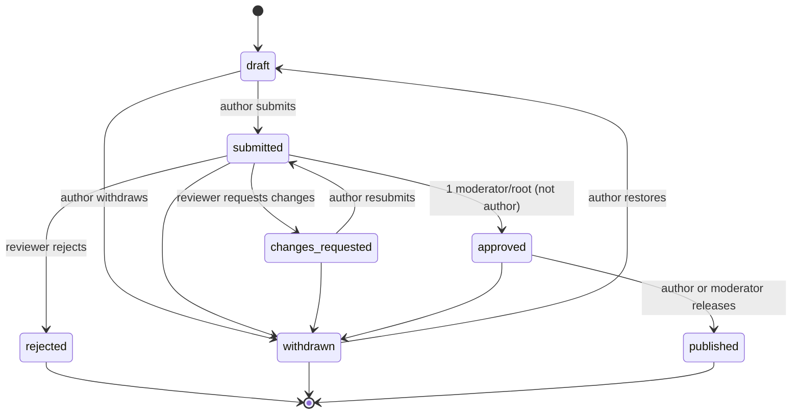
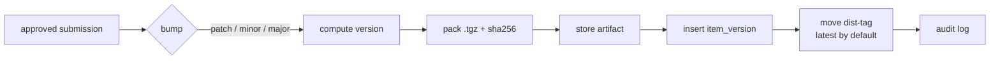

# Ronne AI Marketplace — MVP

> Status: draft · Source requirements: [`ideas.txt`](./ideas.txt) · Decisions: see [Decision log](#15-decision-log)
>
> Detailed specs live in [`docs/spec/`](../spec/): the [manifest](../spec/manifest.md) and its
> [JSON Schema](../../packages/core/src/schema/ronne.schema.json), and the [CLI files](../spec/cli-files.md).
> Sample items of every type are in [`examples/items/`](../../examples/items/).
> Every dependency follows the [dependency policy](../policies/dependencies.md): licenses, versions and security.

## 1. Vision & goals

Ronne AI Marketplace is an **open-source (MIT), self-hosted, curated registry of AI capabilities** —
skills, agents, rules, hooks, commands and MCP server configurations — that an organisation installs
on its own infrastructure. Humans decide what their AI tools are allowed to do: every capability is
proposed, reviewed, approved and released through an explicit process before anyone can install it.

Items are written once in a canonical format and delivered to the major AI coding platforms
(Claude Code, Codex, Cursor, and more later) through the `rmk` CLI and a registry MCP server.

**MVP goals**

- One-command install with a choice of database and interactive root-account creation.
- Role-based accounts (root, moderator, user) managed from the web UI.
- Propose new items or changes to existing ones → review → approve → release with semver + dist-tags.
- Compose agents from skills, MCP servers, tools and hooks with a visual composer.
- Search, install, update and remove items from the terminal (`rmk`) and from inside AI tools (MCP).

**Non-goals for the MVP**

- Public multi-tenant SaaS, billing, or a public item catalogue.
- SSO in the first release. It is planned as a follow-up (§14.3), and the auth library is chosen so it can be added without a rewrite.
- Remote object storage (S3) — local disk only, behind an adapter.
- Federation between Ronne instances and release signing (§14.1, §14.2).
- Importing items from external marketplaces.
- Notifications.

## 2. Personas & roles

| Role | Who | Summary |
|---|---|---|
| **root** | The first is created at install time; any root can make others root ([059](../features/059-multiple-roots/SPEC.md)). Instance owners. | Everything a moderator can do, plus user and instance administration and overrides. |
| **moderator** | Trusted reviewers. | Reviews, approves and releases submissions; deprecates and yanks versions. |
| **user** | Everyone else. | Browses and installs items; proposes new items and changes. |

**Permission matrix**

| Action | user | moderator | root |
|---|:-:|:-:|:-:|
| Browse catalogue, install items (web / CLI / MCP) | ✅ | ✅ | ✅ |
| Create draft & submit new item | ✅ | ✅ | ✅ |
| Propose change to an existing item | ✅ | ✅ | ✅ |
| Comment in a review | own | ✅ | ✅ |
| Request changes in a review | — | ✅ | ✅ |
| Approve or reject a submission (not their own) | — | ✅ | ✅ |
| Publish an approved submission (own or any) | own | ✅ | ✅ |
| Move dist-tags, deprecate a version | — | ✅ | ✅ |
| Yank a version | — | ✅ | ✅ |
| Approve own submission (override, audited) | — | — | ✅ |
| Create scopes | — | — | ✅ |
| Create / disable users, change roles (root included, not their own) | — | — | ✅ |
| Instance settings (the usage policy, [046](../features/046-usage-telemetry/SPEC.md)) | — | — | ✅ |

Users are **only created from the web app** (by root). The CLI never registers accounts.

**Scopes and ownership.** Scopes are open: anyone can propose a new item or a change in any scope,
because review is the gate. Only root creates scopes. An item's `owner_id` records its original
author and grants no extra rights. The "own" in *Publish* means the author of that approved
submission, so a user whose change proposal to someone else's item is approved may release it.

## 3. Core concepts

### 3.1 Item types

Ronne supports **every kind of customization the major AI platforms use today** (surveyed in
September 2026, see §3.3). Each type has a canonical, platform-neutral definition. Renderers translate
it to each tool, and platforms without an equivalent are skipped with a warning.

| Type | What it is | Canonical source | Platform equivalents |
|---|---|---|---|
| `skill` | A folder of instructions + optional scripts/resources, loaded by the AI on demand | `SKILL.md` folder ([Agent Skills](https://agentskills.io/specification) standard) | Skills (all platforms) |
| `agent` | A sub-agent: prompt, allowed tools, model hint, and the skills/MCP servers/hooks it uses | Markdown + YAML frontmatter | Subagents / custom agents |
| `rule` | Always-on, glob-scoped, model-decided or manual guidance | Markdown + frontmatter `activation: always \| glob \| model \| manual`, `globs:` | CLAUDE.md / `.claude/rules`, AGENTS.md, `.cursor/rules`, Copilot instructions, GEMINI.md, Devin rules, Kiro steering |
| `command` | A reusable prompt / slash command / workflow template, with arguments | Markdown + frontmatter (`args`, `description`) | Slash commands, prompt files, Gemini TOML commands, Devin workflows |
| `hook` | A command run on an AI-tool lifecycle event | `hook.yaml`: canonical event + matcher + command/script | Hooks (Claude, Codex, Cursor, Copilot, Gemini, Devin, Kiro) |
| `mcp-server` | Connection config for an MCP server (stdio command or HTTP URL, args, env var **names** only) | `mcp.yaml` | MCP config files (all platforms) |
| `permission-policy` | Allow / ask / deny rules for tools and shell commands | `policy.yaml`: `{ tool, pattern, decision }` list | Claude `permissions`, Codex `.rules` (Starlark) + approval profiles, Copilot permissions, Gemini policy |
| `output-style` | A system-prompt style that changes how the agent responds | Markdown | Claude Code only |
| `statusline` | A status-line script / config | Script + `statusline.yaml` | Claude Code, Codex |
| `lsp-server` | A language-server config that gives the agent code intelligence | `lsp.yaml` | Claude Code (via plugin), Copilot CLI |
| `bundle` | A named set of items installed together; the unit the visual composer edits (§8) | `ronne.yaml` with `dependencies` only | Plugins / extensions / powers (see *native plugin feeds* in §3.3) |

Every item name is **scoped**, such as `@team/code-review`, and unique within the instance. Scopes
and names are lowercase `a-z`, `0-9` and `-`. An item's type is fixed when it is first created; a
different type means a new item.

**Which types can depend on which.** Only composite types have dependencies:

| Type | May depend on |
|---|---|
| `bundle` | any type |
| `agent` | `skill`, `mcp-server`, `hook`, `rule`, `command` |
| `skill`, `command` | `mcp-server` |
| all other types | nothing |

**Canonical hook events.** Hooks are the least standardised type. Ronne uses a neutral event vocabulary:

| Canonical event | Meaning |
|---|---|
| `session.start` | A session begins |
| `session.end` | A session ends |
| `prompt.submit` | The user sends a prompt |
| `tool.before` / `tool.after` | Around any tool call; matcher filters by tool (`shell`, `edit`, `read`, `mcp:<server>`…) |
| `permission.request` | The agent asks for permission |
| `subagent.start` / `subagent.stop` | Around a sub-agent run |
| `compact.before` | Before context is compacted |
| `agent.stop` | The agent finishes responding |

It maps them to each platform's names, for example `tool.before` → `PreToolUse` (Claude, Codex, Copilot),
`preToolUse` / `beforeShellExecution` (Cursor), `BeforeTool` (Gemini), `pre_run_command` (Devin).
An event with no equivalent on a target makes the renderer warn and skip that hook.
**Hooks, permission policies and MCP servers are flagged as high-risk in review** (§12).

### 3.2 Canonical manifest — `ronne.yaml`

Each item version is a directory with a `ronne.yaml` manifest plus its files. The manifest is the
single source of truth; platform-specific files are **generated** from it at install time.

```yaml
name: "@platform/code-reviewer"
type: agent
version: 1.4.0            # set by the release process, not by the author
description: Reviews diffs for correctness and security issues.
license: MIT
keywords: [review, security]

files:
  - prompt.md             # agent system prompt

agent:
  prompt: prompt.md
  tools: [read, grep, bash]
  model: default

dependencies:             # what the visual composer edits
  "@platform/secure-coding": "^2.0.0"     # skill
  "@platform/github-mcp": "~1.1.0"        # mcp-server
  "@platform/lint-on-edit": "^1.0.0"      # hook

targets:                  # optional per-platform overrides / opt-outs
  claude-code: {}
  codex: {}
  cursor:
    enabled: false        # this agent is not offered for Cursor
```

The manifest is validated by a shared JSON Schema in `packages/core` (used by the web app, CLI and
MCP server). The full field reference for every type is in [`docs/spec/manifest.md`](../spec/manifest.md).

### 3.3 Platform renderers

#### Goal: any platform — is that complex?

**Not in the core. The ongoing cost is maintenance.** Everything that matters is platform-neutral:
the manifest, versioning, review, dependency resolution and the lockfile. A platform is a
**renderer module** implementing one interface:

```ts
interface PlatformRenderer {
  id: string;                                      // "claude-code", "codex", …
  detect(probe: ProjectProbe): Promise<boolean>;   // auto-pick the target
  supports(type: ItemType): SupportLevel;          // "native" | "degraded" | "none"
  render(item: RenderInput, context: { scope: "project" | "user" }): RenderResult;
}
// Removing needs no method: .rmk/state.json records every change rmk made (spec 021).
```

Adding a platform means writing one module plus fixture tests (golden files). That is days, not weeks,
and it can be contributed by the community. Two things make it manageable:

1. **Standards are converging.**
   - Agent Skills (`SKILL.md`) is read by every surveyed tool, and many read the neutral `.agents/skills/` path.
   - `AGENTS.md` is read by Codex, Cursor, Copilot, Devin and Antigravity.
   - MCP is universal.
   - Renderers prefer these shared formats, so one rendered file often serves several tools.
2. **Degrade, don't fail.** When a platform has no equivalent (for example output styles outside Claude Code), `rmk` warns and continues. The item page shows a support matrix, so users know before installing.

The real costs:
- Platforms change paths often. Windsurf became Devin Desktop, and Gemini CLI moved to Antigravity CLI, in 2026 alone.
- Hook semantics differ between tools.

Mitigations: renderers are versioned, each has golden-file tests, and each platform has a named maintainer.

#### Platform tiers

| Tier | Platforms | When |
|---|---|---|
| 1 | Claude Code, Codex CLI, Cursor | MVP (M4–M5) |
| 2 | GitHub Copilot (VS Code + CLI), Antigravity CLI and Gemini CLI, Devin (Desktop and CLI; ex-Windsurf) | Right after the MVP |
| 3 | Kiro, Cline / Roo, JetBrains Junie, … | Community renderers |

#### Mapping (project scope; user scope uses the home-directory equivalents)

Surveyed September 2026; the Claude Code, Codex and Cursor columns were re-checked on 2026-09-28 for 023, 024 and 025, and the Copilot, Gemini CLI, Antigravity CLI and Devin columns on 2026-09-28 for the 028–030 specs. Paths are re-verified when each renderer is built.

| Type | Claude Code | Codex CLI | Cursor | Copilot | Gemini CLI | Antigravity CLI | Devin |
|---|---|---|---|---|---|---|---|
| skill | `.claude/skills/<n>/` | `.agents/skills/<n>/` (user: `~/.agents/skills/`) | `.agents/skills/<n>/` (also reads `.cursor/skills/`, `.claude/skills/`, `.codex/skills/`) | `.agents/skills/<n>/` (also reads `.github/`, `.claude/skills/`) | `.agents/skills/<n>/` (also `.gemini/skills/`) | `.agents/skills/<n>/` | `.agents/skills/<n>/` (also reads `.claude/`, `.github/`, `.windsurf/skills/`) |
| agent | `.claude/agents/<n>.md` | `.codex/agents/<n>.toml` (`name`, `description`, `developer_instructions`) | `.cursor/agents/<n>.md` (no tools field; `readonly`; also reads `.claude/agents/`) | `.github/agents/<n>.agent.md` (also reads `.claude/agents/`) | `.gemini/agents/<n>.md` | `.agents/agents/<n>.md` (own tool names) | `.devin/agents/<n>.md` (preview; also reads `.claude/`) |
| rule | `.claude/rules/<n>.md` | section in `AGENTS.md` (one file per folder, 32 KiB cap) | `.cursor/rules/<n>.mdc` (user rules are a setting, not a file) | `.github/instructions/<n>.instructions.md` (`applyTo`) | section in `GEMINI.md` | `.agents/rules/<n>.md` (`trigger`, `globs`) | `.devin/rules/<n>.md` (`trigger`) |
| command | rendered as a skill, `.claude/skills/<n>/` (`.claude/commands/` is legacy) | rendered as a skill (custom prompts are deprecated) | rendered as a skill with `disable-model-invocation: true` | rendered as a skill (prompt files are VS Code Local only) | `.gemini/commands/<n>.toml` | rendered as a skill (every skill is a command) | rendered as a skill (workflows dropped with Cascade) |
| hook | `hooks` in `.claude/settings.json` | `.codex/hooks.json` (same events as Claude Code; trusted in `/hooks` first) | `.cursor/hooks.json` (`version: 1`, its own event names; also runs Claude Code's hooks) | `.github/hooks/<n>.json` (CLI format, one file per item) | `hooks` in `.gemini/settings.json` (`BeforeTool`…, ms) | `<n>` in `.agents/hooks.json` | `.devin/hooks.v1.json` (Claude Code format) |
| mcp-server | `.mcp.json` | `[mcp_servers.<n>]` in `.codex/config.toml` (secrets by env var name: `env_vars`, `bearer_token_env_var`) | `.cursor/mcp.json` (`${env:NAME}`) | `.github/mcp.json` (CLI) and `.vscode/mcp.json` (VS Code) | `mcpServers` in `.gemini/settings.json` | `.agents/mcp_config.json` (no env reference syntax documented) | `.devin/mcp_config.json` |
| permission-policy | `permissions` in `.claude/settings.json` | `.codex/rules/<n>.rules` (Starlark, `allow`/`prompt`/`forbidden`; experimental) | `permissions` in `.cursor/cli.json` (the CLI only; `Shell(cmd:args)`, no ask) | none (nothing a repo can commit) | user only: `~/.gemini/policies/<n>.toml` (project policies non-functional) | user only: `~/.gemini/antigravity-cli/settings.json` | `permissions` in `.devin/config.json` |
| output-style | `.claude/output-styles/<n>.md` | none | none | none | none | none | none |
| statusline | `statusLine` in settings | none (`tui.status_line` takes built-in ids only) | none (the CLI has one, undocumented) | user only: `statusLine` in `~/.copilot/settings.json` | none | user only: `statusLine` | none |
| lsp-server | `.lsp.json` in a generated local plugin (plugins only) | none | built-in, not needed | `.github/lsp.json` (CLI) | none | none | none |
| bundle | installs members (or native plugin feeds) | same | same | same | same | same | same |

Notes:
- Claude Code reads `AGENTS.md` only when the project has no `CLAUDE.md` (checked 2026-09-28), so rules for Claude go to `.claude/rules/`, which it always reads ([023](../features/023-claude-code-renderer/SPEC.md)).
- The Codex and Cursor columns were re-checked on 2026-09-28 for [024](../features/024-codex-renderer/SPEC.md) and [025](../features/025-cursor-renderer/SPEC.md): both moved commands into skills, and Cursor also reads `.claude/skills/`, `.claude/agents/` and Claude Code's hooks for compatibility, which matters when both are targets. With both targets, Cursor leaves skills, commands and hooks to Claude Code's copy (re-checked 2026-09-29 for 025).
- When one project targets several tools, the renderer writes each shared format once. For example, a single `.agents/skills/<n>/` serves Codex, Cursor, Gemini and Devin.

#### Native plugin feeds (M11)

Several platforms have their own plugin marketplaces:
- Claude Code: `.claude-plugin/marketplace.json`
- Codex: `.agents/plugins/marketplace.json`
- Cursor: `.cursor-plugin/marketplace.json` (Cursor and Copilot also read [Agent Plugins 1.0](https://agent-plugins.org/) plugins)
- Gemini: extensions

A Ronne instance **publishes its released items as a native marketplace feed** for each of these,
so people can install from inside the tool without `rmk`, while Ronne stays the source of truth and
the approval gate (owner, 2026-10-03; M11, contract in [plugin feeds](../spec/plugin-feeds.md)):
- Every installable item is a plugin, with its dependencies; a bundle is a plugin with its members.
  Plugins are built from the renderers' output, so the mappings above stay the single source.
- **Claude Code** adds the instance directly: an HTTPS `marketplace.json` with `archive` (zip)
  entries, read with a personal access token through `headersHelper` ([077](../features/077-claude-code-marketplace/SPEC.md)).
- **Codex and Cursor** only add git repositories (Cursor: a team admin imports it), so `rmk feed
  build` writes the feed as a repository tree that a scheduled CI job keeps current ([078](../features/078-plugin-feed-mirror/SPEC.md)).

(This was called "native plugin export" until 2026-09-30; "export" now means sending a local item
to the registry as a draft, §4.1 and §6.)

Rules for renderers:

- **Where comments are allowed** (Markdown, TOML, YAML, scripts), generated files carry a marker such
  as `<!-- managed by rmk: @scope/name@1.4.0 -->`. Shared Markdown files like `AGENTS.md` get a fenced
  section between `<!-- rmk:begin @scope/name -->` and `<!-- rmk:end @scope/name -->`.
- **JSON has no comments**, so `settings.json`, `.mcp.json`, `hooks.json` and similar files are
  edited key by key. The source of truth for what rmk owns is the local state file
  `.rmk/state.json` (see [CLI files](../spec/cli-files.md)). It lists every file and every JSON or
  TOML key path rmk wrote, with a hash of what it wrote.
- **Never overwrite unmanaged content.** Before an update or removal, rmk compares the file or key
  with the hash in the state file. If a user has edited it, rmk stops, reports the conflict, and
  leaves it alone unless `--force` is given.
- If an item type isn't supported on a target, `rmk` warns and skips it. It doesn't fail the whole install.

### 3.4 Versions and dist-tags

- Versions follow **semver** and are **immutable** once published.
- **Dist-tags** are movable pointers, as in npm: `latest` (default, set on every stable release),
  plus optional tags like `next` or `beta`. Installing without a version resolves `latest`.
- **Pre-releases** are real semver pre-releases, such as `1.1.0-beta.1`. They are published under a
  tag other than `latest` (`next` by default) and never become `latest`. Ranges like `^1.0.0` don't
  match pre-releases, following npm's rules.
- **Deprecate**: the version stays installable but shows a warning.
  **Yank**: new installs can't resolve it, but existing lockfiles still can.

## 4. Workflows

### 4.1 Submission lifecycle (new item or change proposal)



- **Drafts** are private to the author. They can be edited in the form editor, the file editor or the visual composer.
- **A draft can also arrive from the author's AI tool** (M7, owner 2026-09-30): `rmk export`, or the registry MCP server's export tools, read an item the person wrote in the tool's own files (a skill folder, an agent, a command, a rule, an MCP server), show what would be uploaded, and create the draft with the person's token ([037](../features/037-draft-upload-api/SPEC.md)–[041](../features/041-export-dependencies/SPEC.md), [native readers spec](../spec/native-readers.md)). The person picks the scope. Nothing is submitted from there: reviewing the draft and submitting it stay in the web app.
- **Withdrawing** is allowed until release: from `draft`, `submitted`, `changes_requested` (owner decision, 2026-09-27) or `approved` (owner, 2026-10-02). It asks whether to **archive** (`withdrawn`, shown as "archived": private to the author, restorable as a draft) or **delete for good**, which only a submission nobody has reviewed allows (owner, 2026-10-02, [057](../features/057-withdraw-archive-delete/SPEC.md)). An approved one can therefore only be archived.
- **Approval** needs one moderator or root other than the author. Root can self-approve as an audited override.
- **Approval freezes the content**, so any later edit sends the submission back to `submitted`.
- **Change proposals** work the same way, but target an existing item. The reviewer sees a diff against the version it was based on (usually `latest`). If a newer version was published in the meantime, the submission is marked **stale** and must be rebased before it can be approved.

### 4.2 Release



- The publisher chooses the bump (the default is suggested from the diff) and the dist-tag.
- A first stable release is `1.0.0`. A first pre-release is `1.0.0-<id>.1`, such as `1.0.0-beta.1`.
  Later pre-releases increase the number, and releasing the stable version drops the suffix.
- Artifacts are stored as `storage/<scope>/<name>/<version>.tgz` behind a `StorageAdapter` interface. Local disk is used for the MVP.

### 4.3 Install / update

1. `rmk install @platform/code-reviewer --target claude-code` resolves the dist-tag or range and the dependency tree.
2. It downloads the tarballs and verifies each sha256.
3. It renders the files for the target and writes `rmk.lock`, which records the resolved versions and checksums.
4. `rmk update` re-resolves within the ranges and re-renders. `rmk remove` deletes only the files marked as managed by rmk.

**Resolver rules** (implemented once in `packages/core`, used by the CLI, the MCP server and `POST /resolve`):

- **One version of each item per install scope.** Rendered files are named after the item (for
  example `.claude/skills/<name>/`), so two versions can't sit side by side. The resolver picks the
  highest version that satisfies every range that asks for the item.
- **Conflicts fail the install.** If no version satisfies all the ranges, the resolver stops and
  names the items that asked for each range. Nothing is written.
- **Cycles are rejected** at submission time, and again by the resolver.
- **Yanked versions** are skipped when resolving a range, but a version pinned in `rmk.lock` is
  still downloaded.
- **Deprecated versions** resolve normally and print their message.

**Lockfile location.** A project install writes `rmk.lock` at the project root, next to
`rmk.config.json`. A user-scope install (`--scope user`) writes `~/.config/rmk/user.lock`. Formats
are in [CLI files](../spec/cli-files.md).

**Secrets.** rmk never stores secret values. An `mcp-server` item lists the env var names it needs,
and the renderer writes references such as `${GITHUB_TOKEN}` in each platform's own syntax. After
an install, rmk lists the variables that aren't set in the current environment and tells the user
how to set them.

## 5. Installation / bootstrap

Two supported paths:

- **Node:** `pnpm dlx @ronneai/marketplace init` (or, from a clone or fork, `pnpm build && pnpm
  start` and open the address)
- **Docker:** with only `compose.yaml`, `docker compose up -d` (pulls `ronneai/marketplace` from
  Docker Hub) and open the address (details in [feature 005](../features/005-docker/SPEC.md) and,
  for the published image, [035](../features/035-docker-hub-image/SPEC.md))

Either way, the first visit opens the setup in the browser ([036](../features/036-web-setup/SPEC.md)):
until the instance is set up, every page redirects to `/setup` and the API answers `503
setup_required`. The same setup runs in the terminal as `pnpm run setup` (in Docker,
`docker compose exec web pnpm run setup`), for scripts, and for a public host that should be set up
before its port is exposed, since the first visitor owns the instance. Neither needs a restart:
the app reads its settings on each request.

Supported databases: SQLite (default), MySQL 8.4+, MariaDB 10.11+ and PostgreSQL 15+. Every pull
request runs the database tests on the minimum versions, and a weekly run tests the latest ones
([feature 004](../features/004-ci-db-matrix/SPEC.md)).

Supported runtimes: the target is the newest Node.js Active LTS (24 in September 2026), used for
development, CI and the Docker image. The minimum for self-hosting and `rmk` is the oldest LTS
still receiving security fixes (22, until April 2027). The Docker image is built for `linux/amd64`
and `linux/arm64`. See the [dependency policy](../policies/dependencies.md#2-versions).

npm packages: `@ronneai/marketplace` (installer), `@ronneai/rmk` (the CLI; its binary is `rmk`,
because the unscoped `rmk` package name is taken), `@ronneai/mcp` and `@ronneai/core`. The
`@ronneai` scope is ours on npmjs.com and matches the GitHub organisation; `@ronne` isn't ours.
They're published to npmjs.com, not GitHub Packages: see the decision log (§15).

The setup, in the browser or as the `setup` script:

1. **Pick a database:** SQLite (default, stored in `./data/ronne.db`), MySQL/MariaDB, or PostgreSQL.
2. **Enter server details** (not asked for SQLite): host, port, database name, user and password. Ronne does **not** install the database server.
3. **Validate the connection**, then check permissions by creating and dropping a probe table. On failure, show the error and ask again.
4. **Write `.env`**: `DATABASE_URL`, a generated `AUTH_SECRET`, `STORAGE_PATH`, `PUBLIC_URL`.
5. **Run migrations** with Kysely's migrator.
6. **Create the root account**: email, password (entered twice), and display name.
7. Send the person to sign in (the browser), or print the URL and the next steps (the script).

The setup refuses to create a root account if one already exists; more roots are added from the admin area ([059](../features/059-multiple-roots/SPEC.md)). A separate `pnpm run reset-root-password` command handles recovery (`--email` picks the root when there are several).

`pnpm setup` (without `run`) is a pnpm built-in that configures pnpm itself, so the command is always
written `pnpm run setup`. Full behaviour, including a non-interactive mode for Docker and CI, is in
[feature 003](../features/003-setup-installer/SPEC.md).

## 6. CLI — `rmk`

> The names `ronne` and `ronneai` are reserved for another product.

| Command | Description |
|---|---|
| `rmk login [--registry <url>]` | Prompts for email and password, exchanges them for a **personal access token**, and stores it in `~/.config/rmk/config.json` (mode 0600). A registry named with `--registry` becomes the default. |
| `rmk login --token <token>` | Uses a personal access token created in the web app (**Access tokens**), for example in CI or where typing a password isn't wanted. |
| `rmk logout` / `rmk whoami` | Revoke the token locally and on the server / show the current user and registry, and where the registry came from. |
| `rmk search <query>` · `rmk list [--installed]` | Browse the catalogue / show installed items. |
| `rmk info <item>[@version]` | Show metadata, versions, dist-tags and dependencies. |
| `rmk install <item>[@tag\|range]... [--target <platform>[,<platform>]\|all] [--scope project\|user]` | Install items. The default target comes from `rmk.config.json`, or is detected from the project. `rmk platforms` lists the available renderers and which item types each supports. |
| `rmk update [item]` · `rmk outdated` | Update within ranges / list available updates. |
| `rmk remove <item>` | Remove the item and its managed files. Dependencies are removed too if nothing else needs them. |
| `rmk export [<path\|name>...] [--to <@scope>]` | Send items you wrote in your AI tool's folders to the registry as **drafts** (M7, [038](../features/038-rmk-export/SPEC.md)): shows what would be uploaded, asks, uploads, and prints each draft's address. It never submits, and refuses items `rmk` installed. |
| `rmk telemetry [on\|off\|status\|preview\|flush]` | Usage reporting under each registry's policy ([046](../features/046-usage-telemetry/SPEC.md)): `status` shows the policy and whether rmk reports; `off` and `on` are the person's choice where the policy lets them choose; `preview` prints what would be sent. `rmk telemetry hook <tool>` is what the AI tools' usage hooks run. |

- There is no `register` command.
- Every command except `login` needs a valid token. Tokens can be revoked from the web UI.
- `rmk.lock` is meant to be committed so that a team gets reproducible installs.
- Output is human-readable by default, with `--json` for scripts and agents.

## 7. Registry MCP server

`packages/mcp` exposes the registry to AI tools, so users can manage items without leaving Claude Code, Codex or Cursor.

- **Read tools:** `search_items`, `get_item`, `list_installed`, `check_outdated`.
- **Plan tools:** `plan_install`, `plan_update`, `plan_remove`. They write nothing. Each returns a
  `planId` and a readable list of the files and keys it would change, plus any warnings (skipped
  types, missing env vars, risk flags).
- **Apply tool:** `apply_plan(planId)`. It writes the planned changes.
- **Export tools** (M7, [039](../features/039-mcp-export-tools/SPEC.md)): `list_local_items` and
  `plan_export` read and upload nothing; `export_items(planId)` creates the drafts of that plan in
  the registry. `plan_export` gives no `planId` until the person has chosen the scope (and, with
  [041](../features/041-export-dependencies/SPEC.md), what to do with the item's dependencies), so
  the assistant has to ask.
- It runs locally over stdio and reuses the `rmk` token and config, plus the same resolver and renderers from `packages/core`.
- **Why two steps:** an AI tool asks the user for permission *before* a tool call runs, not after.
  Splitting plan and apply means the user sees the plan in the conversation, and then approves the
  `apply_plan` call. Plans expire after 10 minutes, and applying fails if the lockfile or any
  target file changed since the plan was made. Exports follow the same rule: the plan names every
  file that would leave the machine, and `export_items` is the call the person approves.
- `rmk mcp-setup --target <platform>` registers the MCP server with each platform.

## 8. Web application

| Area | Pages / features |
|---|---|
| Auth | Sign in (email and password only), sign out, change password, manage personal access tokens. "Forgot password" explains that a root admin resets it; there's no email in the MVP |
| Home | Search box; recently published and most used items (by download count); the viewer's submissions in progress and, for moderators and root, the review count ([018](../features/018-catalogue/SPEC.md)). A page of its own, which later sections join |
| Catalogue | Search and filter by type and keyword; item page with README, versions, dist-tags, dependencies and install snippet |
| Authoring | Submission editor: manifest form + file editor (CodeMirror 6) + `.zip` import + **visual composer** |
| Review | Queue of `submitted` items; diff view; comments; approve / request changes / reject; risk flags (§12) |
| Release | Publish dialog (bump, dist-tag, notes); move tags; deprecate / yank |
| Admin (root) | Users (create, disable, reset password, change role); instance settings; audit log |

**Visual composer** ([031](../features/031-visual-composer/SPEC.md)). Built with React Flow. It
shows a canvas where an agent (or bundle) node connects to skill, MCP server, hook, rule and command
nodes picked from the catalogue, each with a version-range selector. The canvas is a **view over
`dependencies` in `ronne.yaml`**: saving writes the manifest, so reviews always see a plain text
diff. Canvas positions are stored in `.ronne/layout.json` in the draft. The packer leaves `.ronne/`
out, so they are never released, and review diffs only say that they changed.

## 9. Architecture

### 9.1 Monorepo (pnpm + Turborepo)

```
ronne-marketplace/
├─ apps/
│  └─ web/                 # Next.js (App Router): UI + server actions + /api/v1
├─ packages/
│  ├─ core/                # manifest schema, semver resolver, packer, platform renderers, API client
│  ├─ cli/                 # `rmk` (commander/citty), depends on core
│  ├─ mcp/                 # registry MCP server, depends on core and cli's library entry (`@ronneai/rmk/lib`)
│  └─ config/              # shared tsconfig, biome, vitest presets
├─ docs/
├─ biome.json
├─ turbo.json
└─ pnpm-workspace.yaml
```

Tooling: TypeScript everywhere, **Biome** for lint and format, **Vitest** for tests,
**Tailwind CSS** for styling, and **Playwright** for end-to-end tests of the main flows (setup,
login, submit, review, release).

### 9.2 Backend: domain-first clean architecture

```
apps/web/src/server/
├─ domains/
│  ├─ identity/            # users, roles, sessions, access tokens
│  │  ├─ actions/          # entry points called by server actions & API routes (validate input, authorize)
│  │  ├─ services/         # use-case / business logic
│  │  ├─ models/           # entities, value objects, zod schemas, types
│  │  ├─ repositories/     # data layer (Kysely queries), behind interfaces
│  │  └─ exceptions/       # domain errors (e.g. InvalidCredentialsError)
│  ├─ items/
│  ├─ submissions/
│  ├─ reviews/
│  ├─ releases/
│  └─ storage/             # StorageAdapter (local disk; S3 later)
├─ db/                     # Kysely instance, dialect factory, migrations
└─ http/                   # API route helpers: auth guard, error → HTTP mapping
```

- Dependencies point inwards: `actions → services → models`. Services depend on repository interfaces, not on Kysely directly.
- The Next.js server actions (web) and `app/api/v1/**` routes (CLI and MCP) are thin adapters over the same `actions`.
- Domain exceptions are mapped to HTTP status codes and UI errors in one place.

### 9.3 Frontend: feature-first

```
apps/web/src/
├─ app/                               # routes only; compose features
├─ features/
│  └─ submission-editor/
│     ├─ SubmissionEditor.tsx
│     ├─ SubmissionEditor.test.tsx
│     ├─ hooks.ts
│     ├─ types.ts
│     └─ components/
│        └─ composer-canvas/          # sub-component with its own hooks/types/tests
└─ components/
   └─ ui/                             # shared primitives: Button, Table, Modal, Tabs, Input, …
```

Everything that belongs to a feature lives in its folder. Anything used by more than one feature
moves to `components/` (UI primitives go in `components/ui`).

### 9.4 Database

- **Kysely**, with the dialect picked at runtime from `DATABASE_URL`:
  `better-sqlite3` (the default), `mysql2` for MySQL/MariaDB, or `pg`.
- One set of migrations, restricted to features all three dialects share.
  Dialect-specific behaviour (JSON columns, upsert syntax) sits behind small helpers in `db/`.
- CI runs the repository tests against all three databases, using service containers for MySQL and PostgreSQL.

**Portability rules** for every migration and query:

| Concern | Rule |
|---|---|
| Primary keys | ULIDs stored as `varchar(26)`, generated in the app. No auto-increment, so IDs are the same on all three databases and sort by creation time. |
| Timestamps | Stored in UTC. Columns are named `*_at`. |
| JSON | Stored as `text` and parsed in the repository layer. No JSON operators in queries. |
| Booleans | Avoided in favour of nullable timestamps (`disabled_at`, `revoked_at`, `yanked_at`). The one exception is Better Auth's `user.email_verified`, which it requires as a boolean. |
| Search | Case-insensitive `LIKE` on name, description and keywords, through a helper in `db/`. Full-text search is a later improvement. |
| Upserts | Only through the `db/` helper, which picks `ON CONFLICT` or `ON DUPLICATE KEY` for the dialect. |
| Strings | `varchar(n)` with an explicit length when indexed, because MySQL needs index lengths. `text` otherwise. |
| Foreign keys | Table-level constraints (`addForeignKeyConstraint`), never inline column `REFERENCES`: MySQL 8.4 accepts inline ones and silently creates nothing. A test rejects inline `.references(` in migrations. |

### 9.5 Auth

- **Library:** Better Auth with its Kysely adapter. It runs on all three databases and leaves room for OIDC/SAML SSO later (§14.3). It is wrapped by the `identity` domain, so the rest of the code never imports it directly.
- **Better Auth owns its tables:** `user`, `session`, `account` and `verification`, created through
  our migration set so all three databases share one schema. `role` and `disabled_at` are added to
  `user` as Better Auth additional fields. Password hashes live in `account`, as Better Auth expects.
- **Passwords** are hashed with argon2id, set through Better Auth's custom hash functions (its default is scrypt). Login is rate-limited: 5 attempts a minute per email, and per client IP behind a trusted proxy (006).
- **Web sessions** use httpOnly, secure, SameSite=Lax cookies, backed by Better Auth's `session` table.
- **CLI and MCP** use personal access tokens from our own `access_tokens` table in the `identity`
  domain, not a Better Auth plugin. A token looks like `rmk_<random>`; only its sha256 hash is
  stored, with an optional expiry. Tokens are sent as `Authorization: Bearer`. A disabled user's
  tokens stop working at once.
- **Authorization** is enforced in the `actions` layer from a single role-permission map.

## 10. Data model (MVP)

IDs are ULIDs and timestamps are UTC (§9.4).

| Table | Key columns |
|---|---|
| `user` *(Better Auth)* | id, email (unique), name, email_verified, image, created_at, updated_at, **role** (`root`/`moderator`/`user`), **disabled_at** |
| `session` *(Better Auth)* | id, user_id, token, expires_at, ip_address, user_agent, created_at, updated_at |
| `account` *(Better Auth)* | id, user_id, account_id, provider_id (`credential` for passwords; OIDC providers later), password (hash), created_at, updated_at |
| `verification` *(Better Auth)* | id, identifier, value, expires_at |
| `access_tokens` | id, user_id, name, token_hash (unique), last_used_at, expires_at, revoked_at, created_at |
| `scopes` | id, name (unique), description, created_by (set null), created_at |
| `items` | id, scope_id, name, type, description, owner_id, download_count (counted by the tarball endpoint), listed_version_id, installable, last_published_at (the catalogue's listing, recomputed when versions or tags change, [018](../features/018-catalogue/SPEC.md)), created_at — unique (scope_id, name) |
| `item_versions` | id, item_id, version, manifest (JSON), readme, files (JSON: paths, sizes, executable), notes, artifact_path, sha256, size, published_by, published_at, deprecated_message, yanked_at, yank_reason, submission_id, description, keywords, risk_flags (for search and the catalogue, 018). `readme` and `files` are copied at publish so pages never unpack an artifact ([015](../features/015-release/SPEC.md)) |
| `dist_tags` | item_id, tag, version_id — PK (item_id, tag) |
| `version_dependencies` | version_id, depends_on_item_id, range |
| `submissions` | id, author_id, scope_id, name, type, item_id (null for new), base_version_id, rebase_conflicts (JSON paths a rebase left, [017](../features/017-change-proposals/SPEC.md)), status, created_at, updated_at, submitted_at. The manifest is the `ronne.yaml` in `submission_files` |
| `submission_files` | submission_id, path — PK (submission_id, path); encoding (`utf8`/`base64`), content (long text), size, executable, updated_at. Draft files live in the database; published packages go to the `StorageAdapter` |
| `submission_revisions` | id, submission_id, number, created_by, created_at: a snapshot on every submit and resubmit, which reviewers read and releases pack ([014](../features/014-review-queue/SPEC.md)) |
| `submission_revision_files` | revision_id, path — PK (revision_id, path); encoding, content, size, executable (as `submission_files`) |
| `review_events` | id, submission_id, actor_id, kind (`submit`/`resubmit`/`comment`/`request_changes`/`approve`/`reject`/`override`/`withdraw`), body, revision, created_at |
| `audit_log` | id, actor_id, action, target_type, target_id, metadata (JSON), created_at |
| `usage_daily` | item_id, day, version, tool, event, run_trigger, outcome, count — PK on all but count: daily usage totals from `rmk`, kept 90 days, nothing per person or project ([046](../features/046-usage-telemetry/SPEC.md)) |
| `instance_settings` | key (PK), value, updated_by (set null), updated_at: settings root changes in the app, such as the usage policy; no row means the default (046) |

## 11. REST API sketch (`/api/v1`)

| Method & path | Purpose |
|---|---|
| `POST /auth/token` | Email + password → PAT (used by `rmk login`) |
| `DELETE /auth/token` | Revoke the current token |
| `GET /me` | Current user |
| `GET /items?q=&type=&page=` | Search |
| `GET /items/{scope}/{name}` | Item metadata, dist-tags, versions |
| `GET /items/{scope}/{name}/{version}` | Version manifest + dependencies |
| `GET /items/{scope}/{name}/{version}/tarball` | Download the artifact (with an `X-Checksum-Sha256` header) |
| `POST /resolve` | Resolve a set of `{name, range}` to a flat, pinned dependency set |
| `GET /scopes` | The scopes a draft can be created in (M7, [037](../features/037-draft-upload-api/SPEC.md)) |
| `POST /drafts` | Create a draft of a new item with its files, as the token's user (M7, 037) |
| `GET /drafts?name=` | The token's user's drafts, submissions sent back for changes, and submissions in review, of an item (M7, [051](../features/051-update-drafts-on-export/SPEC.md)) |
| `PUT /drafts/{id}` | Replace the files of the token's user's draft, or one sent back for changes, with an upload of the same item (M7, 051) |
| `POST /drafts/check` | Whether Submit would take each of the token's user's drafts (`ids` or `all`), and what's in the way (M7, [052](../features/052-bulk-submit/SPEC.md)) |
| `POST /drafts/submit` | Submit each of those drafts that's ready, each on its own, and answer every result (M7, 052) |
| `GET /usage` · `POST /usage` | Whether the instance accepts usage; report daily counts of installs, removals and runs (M9, [046](../features/046-usage-telemetry/SPEC.md)) |
| `GET /feeds/{tool}/marketplace.json` · `GET /feeds/{tool}/plugins/{scope}/{name}/{version}.zip` | A tool's plugin marketplace and its plugin zips, for Claude Code, Codex and Cursor (M11, [077](../features/077-claude-code-marketplace/SPEC.md), [078](../features/078-plugin-feed-mirror/SPEC.md)) |

Editing, submitting, review, release and admin actions are only available in the web UI (as server
actions). The API reads, with two exceptions (owner, 2026-09-30): a token can **create a draft**
(M7), which is private to its author and reaches nobody until they submit it in the web app, and
**report usage** (M9), which only adds to daily totals.

**Conventions**

- **Errors** always use one shape, produced by the domain-exception mapper in `http/`:
  `{ "error": { "code": "item_not_found", "message": "…", "details": { … } } }`. `code` is a stable
  snake_case string that clients can rely on. The HTTP status carries the category (400, 401, 403,
  404, 409, 413, 422, 429).
- **Pagination** is cursor-based: `?limit=` (default 20, max 100) and `?cursor=`. Responses include
  `nextCursor`, or `null` on the last page.
- **Versioning:** breaking changes go to `/api/v2`. `rmk` sends its version in `User-Agent`, and the
  server can reply `426` with a message when the CLI is too old.

## 12. Security considerations

Items are instructions and code that run on developers' machines with their permissions, so the
review is the security boundary.

- **Risk flags in review.** Submissions containing `hook`s, `mcp-server`s, `permission-policy` items (especially ones that *widen* permissions), `statusline` / `lsp-server` commands, executable scripts, network URLs or shell commands get a highlighted risk summary in the review view.
- **No secrets in items.** `mcp-server` configs declare env var *names*. `rmk` asks for or reads the values locally and never uploads them.
- **Export sends only what the person saw** (M7). `rmk export` and the MCP export tools upload the files listed in the preview and nothing else: never `.env` files, keys, `.git` or symbolic links, never the value of an environment variable, and an item containing a known secret format is stopped ([native readers spec](../spec/native-readers.md) §3). Over MCP only items found in the tools' own folders can be exported, never an arbitrary path.
- **Writes by token** (M7, M9). A token can create drafts and report usage, and nothing else. Each draft is recorded in the audit log with the token's name; the request body, the number of drafts per person and the upload rate are limited ([037](../features/037-draft-upload-api/SPEC.md)). A usage report adds to daily totals, stores nothing about who sent it, has a 256 KiB body limit and a rate of 60 per 10 minutes, and isn't audited ([046](../features/046-usage-telemetry/SPEC.md)).
- **Integrity.** Published versions are immutable, and `rmk` checks sha256 checksums on every download and against `rmk.lock`.
- **Managed-file boundaries.** Renderers write only inside known target paths and never overwrite unmanaged content.
- **Audit log** for approvals, overrides, releases, tag moves, yanks, and user and role changes.
- **Our own supply chain.** Every dependency must have a license that lets anyone use and
  redistribute it, be on a current stable or LTS version, and have no known high or critical
  vulnerabilities. CI enforces this with license, audit and image checks, and pnpm holds back
  releases younger than 3 days. See the [dependency policy](../policies/dependencies.md).
- **Upload limits**, with path-traversal and symlink checks when unpacking. Defaults, which root can
  change in instance settings: 5 MB packed, 20 MB unpacked, 500 files, and 1 MB for any single file.

## 13. MVP scope & milestones

Each milestone is split into numbered features in [`docs/features/`](../features/README.md). Each has
its own `SPEC.md` and `PLAN.md`, and the index there tracks their status.

| # | Milestone | Acceptance criteria |
|---|---|---|
| M0 | Scaffolding & install | Monorepo, Biome and Vitest in CI; `pnpm run setup` works end to end on all 3 DBs, including connection validation and root creation. |
| M1 | Auth & users | Login/logout; root creates, disables and re-roles users; PAT management UI. |
| M2 | Items & submissions | Create a draft of any type via form + file editor; submit; manifest validated by the shared schema. |
| M3 | Review & release | Review queue with diff and risk flags; approval rule (1 non-author moderator/root, root override); publish with semver bump and dist-tags; deprecate/yank; audit log. |
| M4 | `rmk` + Claude Code | `login`, `search`, `info`, `install`, `update`, `remove`, `outdated`; lockfile; renderer interface + golden-file test harness; Claude Code renderer for every item type. |
| M5 | Codex, Cursor, MCP | Codex and Cursor renderers with unsupported-type warnings; shared `.agents/skills` output; per-item support matrix in the web UI; registry MCP server and `rmk mcp-setup`. |
| M5b | Tier-2 platforms (on hold since 2026-09-30) | Copilot, Antigravity CLI and Gemini CLI, and Devin renderers ([028](../features/028-copilot-renderer/SPEC.md)–[030](../features/030-devin-renderer/SPEC.md)). |
| M6 | Visual composer and npm | React Flow canvas editing `dependencies`; round-trips to `ronne.yaml`; shown as a text diff in review. `rmk` and the MCP server published to npm under `@ronneai` ([034](../features/034-npm-packages/SPEC.md)). |
| M7 | Export from your tools (after the MVP) | A skill, agent, command, rule or MCP server written in Claude Code's files (and skills in `.agents/skills`) is sent to the registry as a draft with `rmk export` or from inside the AI tool; the person chooses the scope and sees every file before it's uploaded; local dependencies are detected and offered for export too; submitting stays in the web app ([037](../features/037-draft-upload-api/SPEC.md)–[041](../features/041-export-dependencies/SPEC.md)). |

## 14. Future topics

### 14.1 Linking Ronne instances (federation) — post-MVP

**The problem.** A company may run several instances: a central platform-team instance and one per
department, or a public community instance plus a private company one. Without linking, every team has
to re-create the same items by hand.

**The idea.** An instance can declare another instance as an **upstream**, much like npm upstreams or
apt sources:

- **Mirror mode.** The downstream pulls selected items or scopes, such as `@platform/*`, from the upstream on a schedule.
  - Pulled versions arrive as **submissions** in the local review queue, so local moderators still decide what is allowed. This preserves the "humans control" principle.
  - Once approved, the downstream stores its own copy of the artifact, so it keeps working if the upstream goes offline.
- **Proxy mode** (simpler, less control). `rmk` asks the local instance, which resolves any missing item from the upstream on demand. This fits trusted upstreams only.

Each upstream is configured with a URL, a service token and a scope allow-list.
Federation is only safe with **release signing** (below): the downstream needs proof that an artifact
really was published by the upstream.

### 14.2 Signing releases — post-MVP

**Checksums vs. signatures.**
- **Checksum (sha256), already in the MVP.** Proves the file wasn't corrupted or altered *between the server and your machine*. If the server or its storage is compromised, the attacker simply replaces both the file and the checksum.
- **Signature.** Proves *who* published the version. The release process signs the manifest and checksum with a private key, and `rmk` verifies them with the matching public key. A tampered artifact fails verification even when it is served by the real server.

**Options**

| Option | How it works | Fit |
|---|---|---|
| **Instance key (ed25519 / minisign)**, recommended | `setup` generates a key pair per instance and the private key signs every release. `rmk login` pins the instance's public key, and every install verifies against it. | Works offline and air-gapped; no external services; natural for self-hosting and federation (downstreams pin the upstream key). |
| Publisher keys | Each moderator or publisher has their own key, and the signature records exactly who released a version. | Stronger accountability, but users must manage keys. |
| Sigstore (keyless) | Signatures are tied to an OIDC identity and recorded in a public transparency log. | Needs internet and an OIDC provider; less suited to private instances. |

Recommended path: an instance key first (small effort, big gain). Publisher keys can be added later.

### 14.3 SSO — wanted; options to start

Using a library instead of hand-written auth makes SSO an add-on rather than a rewrite.
**Recommended: [Better Auth](https://www.better-auth.com/).** It supports email/password, generic OIDC
and SAML via its SSO plugin, and has a native Kysely adapter, so it works on all three databases.

| Protocol | Covers | Suggested phase |
|---|---|---|
| **OIDC** (generic) | Google Workspace, Microsoft Entra ID, Okta, Keycloak, Authentik, Auth0 | **First.** One integration covers most identity providers (IdPs). |
| SAML 2.0 | Legacy enterprise IdPs, ADFS | Second, if requested |
| LDAP / Active Directory | On-prem directories without OIDC | Later |
| SCIM | Automatic user provisioning and deprovisioning from the IdP | Later |

Design points:
- **Root keeps control.** Root configures the IdP and either pre-creates users, as today, or allows just-in-time creation for chosen email domains with a default role of `user`. IdP groups can optionally map to `moderator`.
- **Emergency access.** Email/password stays available, at least for root, so a broken IdP can't lock everyone out.
- **CLI login for SSO users.** `rmk login` can't ask SSO users for a password. It uses the **OAuth device flow** instead: it prints a code and a URL, the user approves in the browser, and the CLI receives a personal access token. The email/password prompt stays for local accounts.

### 14.4 Other future topics

- **More platforms.** Tier-3 community renderers via the `PlatformRenderer` interface (§3.3).
- **Native plugin feeds.** Planned as M11 for Claude Code, Codex and Cursor (§3.3). Copilot, Gemini and Devin feeds follow their renderers (028–030, on hold).
- **Install telemetry** (a policy root sets per instance, off by default), so moderators can see which items are used. The MVP only counts artifact downloads on the server, for the home page's "Most used" (018). Designed in §14.6; planned as M9.

### 14.5 Decided out of scope for now

- Importing items from external/public marketplaces. (Existing `.claude` folders were on this list until 2026-09-30; exporting the person's own items from them is M7. Cursor's and Codex's own formats are feature [043](../features/043-codex-cursor-readers/SPEC.md).)
- S3-compatible storage (the StorageAdapter interface stays, so it can be added later).
- Notifications (email / webhooks).

### 14.6 Usage telemetry — post-MVP

The owner's item overview mockup (2026-09-30, [045](../features/045-item-overview-dashboard/SPEC.md))
shows usage the registry can't know today. 045 builds the page without it; this section records
what each number needs, so M9 ([features 046, 047](../features/README.md)) starts from it.

**What the mockup shows, and where each number would come from**

| Number | Meaning | Source today | Needs |
|---|---|---|---|
| Total installs, "in N active repository projects" | Projects that have the item installed now | None: the server counts tarball downloads only (019), which include CI and reinstalls | `rmk` reporting `install` and `remove` (046); per project only later (see "Later" below) |
| Harness distribution (Cursor 62% · Claude 28%) | Which AI tools the installs are for | None | The targets of each reported install (046) |
| Invocations (30 days), average per day, success rate | How often the item actually runs, and how often that ends well | None: `rmk` isn't in the loop when a tool runs an agent or a skill | A usage hook that `rmk` installs next to the item, per tool, reporting a run and its outcome (046) |
| Daily execution volume (14 days, with the peak) | Runs per day | None | Invocation events, aggregated per day (046, 047) |
| Harness breakdown (runs per tool) | Runs by tool | None | The tool in each invocation event (046) |
| Invocation triggers (PR webhook, manual `/review`, agent sub-delegation) | What started each run | None | The hook event's kind: a slash command, the model choosing it, another agent delegating, a headless or CI run (046); not every tool says which |

**How it could work**

- **Root decides, per instance** (owner, 2026-09-30; it was "opt-in, always" until 046 was being
  built). On **Admin › Settings**: `off` (a new instance's default), `choice` (on unless the person
  runs `rmk telemetry off` or sets `RMK_TELEMETRY=0`) or `required` (nothing turns it off). `rmk`
  prints a notice the first time it reports to a registry. The in-app Documentation says exactly what
  is sent, and `rmk telemetry preview` prints it.
- **What an event carries:** the item and version, the tool, the event (install, remove, run), for a
  run its trigger and outcome (success, error, cancelled) when the tool reports them, the day and a
  count. **Never** prompts, file contents, paths, project or repository names or ids, branch names,
  user names or environment values.
- **Where it goes:** to the instance it was installed from, and nowhere else (`POST /api/v1/usage`,
  with the person's token; batched, rate-limited, dropped silently when offline). Self-hosted data
  stays self-hosted.
- **What is stored:** daily totals per item, version, tool, event, trigger and outcome, kept 90 days.
  Raw events aren't kept, and nothing per person or per project is stored.
- **Invocations need hooks.** `rmk telemetry on` adds one `rmk`-managed hook to each tool's
  user-level settings, which counts runs of `rmk`-installed items only. Which events each tool exposes
  changes often: check the vendor docs before building (as for renderers, §3.3). As of 2026-09-30,
  Claude Code reports skills, commands, agents and MCP servers; Codex and Cursor report agents and MCP
  servers but no skill or command runs, so those count installs only there
  ([046](../features/046-usage-telemetry/SPEC.md)).
- **Success rate** only where the tool reports how a run ended; otherwise it isn't shown.

**On the item page ([047](../features/047-usage-on-item-page/SPEC.md)):** installs and runs over 30
days replace 045's downloads and versions cards, Works in shows each tool's share, and a Usage card
(daily runs, by tool, trigger and outcome) appears on the Overview as soon as an item has any
reported install or run in 30 days (root can set a minimum), with a note saying the numbers come from `rmk` where the instance collects usage. The
Versions page shows runs and installs per version.

**Decided (owner, 2026-09-30):** a usage policy root sets per instance (off by default; people
choose, on unless they opt out; or required); run hooks added by `rmk install` with a notice; no
projects for now; 90 days of daily totals; any token may report usage; installs only where a tool can't report runs; usage shows from any event in 30 days, or from a minimum root sets, to
everyone signed in; the home page's "Most used" stays on downloads.

**Later: counting projects.** "Installed in N active projects" needs a project id, which 046 leaves
out (owner, 2026-09-30). The design, for when it's picked up:

- **The id:** SHA-256, with a fixed prefix, of the project's normalised `origin` remote (scheme,
  credentials, port and a trailing `.git` dropped; host lowercased, so the HTTPS and SSH forms of one
  repository match), or of the folder path when there's no remote. The URL and path never leave the
  machine.
- **On the server:** HMAC of that hash under a key derived from `AUTH_SECRET`, so a copy of the
  database can't be matched against guessed repository URLs; a table `usage_projects` (item, project,
  tool, version last reported, first and last day, removed day).
- **Active:** installed, not removed, and seen (an install, a run, or a daily `present` that any
  `rmk` command in the project sends) within 30 days.
- **Shown:** counts only, never per project, from a minimum number of projects (5 was proposed), with
  active projects per version on the Versions page.
- **Choices still open then:** the remote versus the folder path only (simpler, but every clone
  counts), user-scope installs (one per person?), and whether "Most used" moves to active projects.

## 15. Decision log

| Topic | Decision | Rationale |
|---|---|---|
| License | MIT | Maximizes adoption and forks |
| CLI binary | `rmk` | Short; `ronne` / `ronneai` reserved |
| Delivery to AI tools | Canonical `ronne.yaml` → per-platform renderers via `rmk`, plus a registry MCP server | Single source of truth; works in the terminal and inside the agents |
| Item types | All current customization types: skill, agent, rule, command, hook, mcp-server, permission-policy, output-style, statusline, lsp-server, bundle; canonical hook events | Cover everything the platforms support; degrade with warnings where a platform lacks a type |
| Platforms | Goal: any. Tier 1 in MVP (Claude Code, Codex, Cursor); tier 2 (Copilot, Gemini/Antigravity, Devin Desktop) specified but on hold (owner, 2026-09-30: not implemented now; 028–030 keep their specs); tier 3 community | Pluggable `PlatformRenderer`; prefer cross-tool standards (Agent Skills, AGENTS.md, MCP) |
| SSO | Wanted soon after MVP: OIDC first via Better Auth, then SAML; CLI uses the device flow | One OIDC integration covers most IdPs |
| Out of scope for now | Import from external marketplaces, S3 storage, notifications. Exporting a person's own local items is no longer out: see "Export" below | Keep MVP focused |
| Backend | Next.js monolith with a domain-first clean architecture; server actions + `/api/v1` | One deployable to self-host; the domain layer stays framework-independent |
| DB access | Kysely; SQLite (default) / MySQL-MariaDB / PostgreSQL chosen at install | One query layer and one migration set across three dialects at runtime |
| Approval | 1 approval from a moderator/root who isn't the author; root override is audited | Four-eyes review without slowing small teams |
| Release | Separate step after approval: publisher picks the semver bump and dist-tag (`latest` default) | npm/apt-style control over what `latest` means |
| Artifacts | Immutable `.tgz` + sha256 on local disk behind a StorageAdapter | Simple to self-host; S3 can be added later |
| Composition | React Flow visual composer over manifest `dependencies` | Visual UX, but reviews stay text diffs |
| Monorepo | pnpm + Turborepo (`apps/web`, `packages/{core,cli,mcp,config}`) | Shared core between web, CLI and MCP |
| MCP server and `rmk` | `packages/mcp` imports `@ronneai/rmk/lib`, `rmk`'s install pipeline as functions (plan, apply, lockfile, state, registry access), and never `rmk`'s command layer; nothing else outside core crosses packages (owner, 2026-09-29, [027](../features/027-registry-mcp-server/SPEC.md)). The export pipeline (find, plan, upload) is exported the same way ([038](../features/038-rmk-export/SPEC.md), 2026-09-30) | The server plans and applies installs exactly as `rmk` does, so one pipeline serves both and they can't drift; moving it into core would put file-system and network code into what the web app imports |
| Front-end | React, Next.js, Tailwind, Biome, Vitest; feature-first folders; shared `components/ui` | From the requirements |
| Auth schema | Better Auth owns `user`/`session`/`account`/`verification` (plus `role`, `disabled_at`); argon2id via custom hash; PATs in our own `access_tokens` table | Don't fight the library's schema; keep token format and revocation under our control |
| Scopes | Every item is scoped; root creates scopes; anyone may propose in any scope; `owner_id` is informational | Review is the gate, so scope membership adds admin work without adding safety |
| Pre-releases | Real semver pre-releases (`1.1.0-beta.1`) under a non-`latest` tag (`next` by default); first stable is `1.0.0` | Matches npm behaviour users already know |
| Secrets | rmk never stores secret values; rendered configs reference env vars and rmk reports missing ones | No secrets on disk from us; every platform reads env vars |
| Managed content | Markers in files that allow comments; `.rmk/state.json` with hashes for JSON/TOML keys; stop on user edits unless `--force` | JSON can't hold markers; hashes detect local edits safely |
| Resolver | One version per item per install scope; conflicts and cycles fail; dependency types restricted (§3.1) | Rendered paths are named per item, so versions can't coexist |
| MCP writes | Two steps: `plan_*` tools return a plan, `apply_plan` writes it. Uploads too: `plan_export` returns the plan, `export_items` sends it ([039](../features/039-mcp-export-tools/SPEC.md)) | AI tools ask permission before a call, so the plan must be visible first |
| DB portability | ULID keys, UTC timestamps, JSON as text, `LIKE` search, upserts via a helper | Keeps one migration set working on all three databases |
| API conventions | One error shape with stable codes; cursor pagination; `/api/vN` versioning. Reads, plus creating a draft (M7); every `POST` body has a size limit ([037](../features/037-draft-upload-api/SPEC.md)) | Stable contract for `rmk` and the MCP server |
| Commit format | `[type] NNN: Description` (or `[type]: Description` without a feature); types `docs`, `feat`, `chore`, `bugfix`; same format for PR titles, checked in CI and by a local hook | Squash merges make the PR title the commit on `main`; the feature ID links history to `docs/features` |
| Planning | One folder per feature, `docs/features/NNN-slug/` with `SPEC.md` and `PLAN.md`; the index there replaces a separate milestone plan; specs only for the current and next milestone | Specs stay next to the work and outlive the schedule; no duplicated acceptance criteria |
| Setup command | `pnpm run setup` (not `pnpm setup`, a pnpm built-in); non-interactive mode for Docker/CI. Since 036 it shares its steps with the web setup and is the terminal alternative | Avoids silently running pnpm's own command |
| Web setup | The first visit to an instance that isn't set up opens the setup in the browser (`/setup`): database with a connection test, public address, root account, then the install shown step by step, then sign-in; open to the first visitor (no setup code; the terminal path exists for hosts that must be set up before the port is exposed); no restart afterwards; `pnpm run reset-setup` puts a development clone back to "not set up" ([036](../features/036-web-setup/SPEC.md), owner 2026-09-29) | `docker compose up -d` from one file, or `pnpm dev` from a clone, ends in a working instance without a terminal step |
| Docker | `node:24-slim` (current LTS, pinned by digest), standalone Next.js, state and config on one `/app/data` volume, migrations on start, the web setup until set up (036; before that, a "run setup" screen). Published to Docker Hub as `ronneai/marketplace` (amd64 and arm64, the npm packages' version, tags `X.Y.Z`/`X.Y`/`X`/`latest`, provenance and SBOM attestations) by the release workflow, after each image was run and scanned ([035](../features/035-docker-hub-image/SPEC.md), 2026-09-29) | One volume to back up; upgrades apply migrations automatically; one file (`compose.yaml`) is enough to run it, and "Ronne 0.1.0" means one thing on npm and Docker Hub |
| Design system | One system from the brand and the Stitch design notes (kept locally in the git-ignored `docs/UI-Mocks-Materials/`; the rules and tokens are in 032's spec): Manrope and IBM Plex Mono self-hosted; flat (no shadows); teal as the single accent; no red, yellow or green alerts; light and dark themes, light by default, switched by a header toggle (no "follow the OS" mode, owner decision 2026-09-27) ([032](../features/032-design-system/SPEC.md)) | Consistent pages from M1 on; no font CDN for a self-hosted product |
| Phones and tablets | Every page works from 360px wide with no sideways page scroll; 44px touch targets and 16px fields on a coarse pointer; nothing only on hover; dialogs full screen on phones. Reading, reviewing, releasing, tokens and admin work fully on a phone; drafts are edited with the form and the text editor, the composer graph is read-only below `md`, and unsaved draft edits are kept in the browser until saved; Ctrl/⌘ plus the wheel zooms the canvas. Checked by phone and tablet projects in the end-to-end tests (M10, [065](../features/065-mobile-foundations/SPEC.md)–[075](../features/075-mobile-sign-off/SPEC.md); owner, 2026-10-02). Install to home screen comes after M10 | Links to items and reviews are opened on phones; a moderator should be able to read a diff and decide without a desk |
| Draft files | In the database (`submission_files`), not a folder on disk; published `.tgz` files still go to the `StorageAdapter` | A save is one transaction with the manifest, and one database backup covers everything; the upload limits keep rows small ([012](../features/012-submission-editor/SPEC.md)) |
| File editor | CodeMirror 6 rather than Monaco, plus single-file upload and `.zip` import | Much smaller, easier to theme with our tokens and usable on phones; `.zip` import brings in existing skill folders ([012](../features/012-submission-editor/SPEC.md)) |
| Withdraw | Allowed until release, including from `submitted` and, since 2026-10-02, `approved`; it asks to archive (restorable, private to the author) or delete for good (only with no review history; audited) (owner, 2026-10-02, [057](../features/057-withdraw-archive-delete/SPEC.md)) | Pulling back a submission that isn't released is harmless: approval freezes its files for release, and withdrawing doesn't change them ([013](../features/013-submit-withdraw/SPEC.md)); closed submissions shouldn't pile up, but a conversation with reviewers is a record worth keeping |
| Review decisions | Request changes and reject, each with a required reason, from each row of the review queue and on the review page, never in bulk; shown disabled with the reason on the reviewer's own submission; the author sees the latest reason at the top of their page (owner, 2026-10-02, [058](../features/058-review-decisions-everywhere/SPEC.md)) | Reviewers couldn't find them on the review page alone; each reason is about one submission (054) |
| Web sign-in | Email and password only; tokens don't sign in to the web; "Forgot?" points to a root reset (no email) | Tokens stay machine credentials, so a leaked token can't open a browser session |
| Login rate limit | Ronne's own in-memory limiter on the sign-in action: 5 attempts a minute per email, and per client IP only with `TRUST_PROXY=true`; Better Auth's HTTP sign-in is not served | Better Auth's limiter skips server actions, and without a trusted proxy the client IP can be forged ([006](../features/006-web-sign-in/SPEC.md)) |
| CLI login | `rmk login` exchanges email and password for a token (`POST /api/v1/auth/token`), and `rmk login --token` accepts one made in the web app; browser-based login waits for SSO's device flow | Matches the MVP and the mock's `--token`, without new endpoints before SSO |
| Which registry | `--registry`, then `RMK_REGISTRY`, then the project's (`registry` in `rmk.config.json`, then `rmk.lock`), then the user's default; `rmk install` records the registry in `rmk.config.json`, and `rmk login --registry` makes it the default (owner, 2026-10-01, [cli-files](../spec/cli-files.md)) | Tokens are personal and stay per machine, but the registry belongs to the project, so teammates and several instances on one machine each get the right one; before this the project's `registry` was documented but unused, and a second login left the old default |
| Roots | Several roots, as peers: setup creates the first, and any root can give any role (root included) and disable or reset any account but their own; at least one active root always remains, enforced under row locks; `pnpm run reset-root-password` (with `--email` when there are several) recovers one. It was "Single root" (008) until the owner changed it, 2026-10-02 ([059](../features/059-multiple-roots/SPEC.md)) | One person away or locked out shouldn't stop the instance being run; no roots at all would reopen the web setup, so the last one is protected |
| Renderer output | Renderers are pure: they return the changes to make (files, folders, JSON and TOML keys, JSON array elements, Markdown sections), and `rmk` applies them and records each in `.rmk/state.json`. There is no `remove()`: removing undoes exactly what the state file recorded ([021](../features/021-renderer-harness/SPEC.md)) | One place decides what may be written or deleted, and renderers stay testable with golden files |
| Item contents on the item page | The item page reads the shown version's `.tgz` from the `StorageAdapter` to show its files (Overview and Files tabs), checked against its sha256 and not counted as a download; web only, no API or MCP endpoint per file yet ([044](../features/044-item-contents/SPEC.md), owner, 2026-09-30) | People should see exactly what they would install; copying every file into the database at release would duplicate the artifact |
| Download counts | The tarball endpoint adds one to `items.download_count` per download; nothing about who downloaded is stored. The home page ranks "Most used" by it | The owner wants most used items on the home page (2026-09-28); a server-side count needs no telemetry from `rmk`, which stays opt-in and post-MVP |
| Usage telemetry | A policy root sets per instance on Admin › Settings: off (a new instance's default), people choose (on unless they run `rmk telemetry off` or set `RMK_TELEMETRY=0`) or required (nothing turns it off); `rmk` prints a notice the first time it reports to a registry, and `rmk install` adds a run hook to each tool's user-level settings when reporting is on; daily totals only, kept 90 days, nothing per person or project; any token may report; shown on the item page from any event in 30 days (root can set a minimum), to everyone signed in; "Most used" stays on downloads (owner, 2026-09-30, [046](../features/046-usage-telemetry/SPEC.md), [047](../features/047-usage-on-item-page/SPEC.md)) | The instance owner decides what their instance collects; counts only, so moderators learn what's used without the instance learning who uses it or where; projects can come later (§14.6) |
| Access tokens | `rmk_` + 43 base64url characters, SHA-256 hashed, 30/90/365 days or no expiry, at most 50 active per user, bearer only on `/api/v1`. No token scopes: every token reads as its user and may create drafts and report usage (owner, 2026-09-30, [037](../features/037-draft-upload-api/SPEC.md), [046](../features/046-usage-telemetry/SPEC.md)), and submit its user's drafts for review (owner, 2026-10-01, [052](../features/052-bulk-submit/SPEC.md)) | Recognizable by secret scanning; revocable; no cookies on the API. Submitting is the first thing a token does that other people see; it stays without scopes because each submit is audited with the token's name, rate-limited, and `rmk` and the MCP tool ask the person first |
| Export | A person's own local items go to the registry as **drafts**, from `rmk export` and the MCP tools `plan_export` / `export_items`; the person chooses the scope; submitting stays in the web app; an item `rmk` installed and the person edited, or their own item whose name is published, becomes a change proposal merged onto its base version ([042](../features/042-export-change-proposal/SPEC.md)); skills first, then agents, commands, rules and MCP servers from Claude Code's files (owner, 2026-09-30, M7: [037](../features/037-draft-upload-api/SPEC.md)–[041](../features/041-export-dependencies/SPEC.md)). "Native plugin export" was renamed "native plugin feeds" to free the word | People write items in their tools first; rebuilding them by hand in the editor is the step that keeps them out of the registry. A draft is the safe landing: nothing is visible to others until its author submits it |
| Exporting again | `rmk export` and the MCP export tools update the person's own draft of the same item (same name and type, and for a proposal the same base), or one sent back for changes, replacing its files; one in review is left alone; `--new-draft` makes a separate draft (owner, 2026-10-01, [051](../features/051-update-drafts-on-export/SPEC.md)) | Drafts no longer pile up or fill the 50-draft limit when a person keeps working in their tool; review stays untouched, and a different item or base stays a different draft |
| Native readers | The reverse of a renderer, in `packages/core`: pure, read-only, and lossy only with a warning per dropped field; secrets and environment values never leave the machine ([native readers spec](../spec/native-readers.md)) | The mapping tables are the renderers' reversed, so both directions stay in step, and the web app could use the readers later |
| Dependencies on export | Detected from what an item uses; the person is asked and exporting them too is recommended; a dependency counts at submit once it's released or an open submission of that name; its range is checked at release, where dependencies go first; rejecting a dependency offers to request changes on its dependents ([041](../features/041-export-dependencies/SPEC.md), 2026-09-30; relaxed by [056](../features/056-pending-dependencies/SPEC.md), owner 2026-10-01) | An exported item should work where it's installed; released still means installable, and an item and its dependencies no longer take one full round each |
| Dependencies | Permissive licenses only (MIT, ISC, BSD, Apache-2.0 …; CC-BY-4.0 for data); no copyleft or paid tools; latest stable/LTS; CI license + audit + image scans; pnpm release-age delay, build allowlist, trust policy | Ronne must be freely redistributable and must not ship known vulnerabilities |
| Packages | `@ronneai/{marketplace,rmk,mcp,core}`; binary `rmk`; Node 24 LTS target, 22 LTS minimum; Docker amd64 + arm64 | Unscoped `rmk` is taken on npm; the owner holds `@ronneai` on npmjs.com (as on GitHub), not `@ronne` (confirmed 2026-09-27) |
| Package registry | Publish to npmjs.com under `@ronneai`; not GitHub Packages as the install source (a mirror there is possible later). The command stays `rmk` | GitHub Packages only takes the repository owner's scope (`@ronneai`), and installing from it needs a GitHub token with `read:packages` and an `.npmrc` registry line, even for public packages: too much friction for a CLI anyone should install with one command |
| Native plugin feeds | Released items are offered as plugin marketplaces: every installable item is a plugin (with its dependencies; a bundle with its members), built from the renderers' output. Claude Code reads a live marketplace from the instance with a token (`headersHelper: rmk auth headers`); Codex and Cursor get a git mirror written by `rmk feed build`; the feed needs a token like the rest of `/api/v1` (owner, 2026-10-03, M11: [076](../features/076-plugin-builders/SPEC.md)–[078](../features/078-plugin-feed-mirror/SPEC.md)) | People install from inside their tool; only Claude Code can add a plain HTTPS source, and Codex and Cursor only add git repositories; serving git from the web app would mean a git implementation for no gain over a mirror. Approval and immutable versions are unchanged, since only released versions are built |
