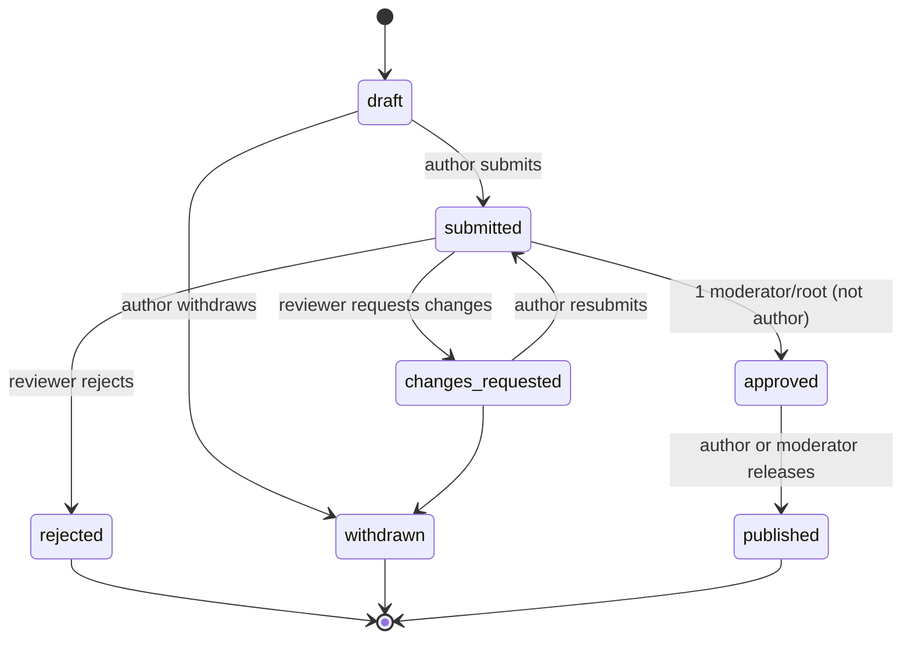
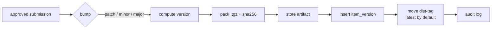

# Ronne AI Marketplace — MVP

> Status: draft · Source requirements: [`ideas.txt`](./ideas.txt) · Decisions: see [Decision log](#15-decision-log)
>
> Detailed specs live in [`docs/spec/`](../spec/): the [manifest](../spec/manifest.md) and its
> [JSON Schema](../spec/ronne.schema.json), and the [CLI files](../spec/cli-files.md).
> Sample items of every type are in [`examples/items/`](../../examples/items/).

## 1. Vision & goals

Ronne AI Marketplace is an **open-source (MIT), self-hosted, curated registry of AI capabilities** —
skills, agents, rules, hooks, commands and MCP server configurations — that an organisation installs
on its own infrastructure. Humans decide what their AI tools are allowed to do: every capability is
proposed, reviewed, approved and released through an explicit process before anyone can install it.

Items are written once in a canonical format and delivered to the major AI coding platforms
(Claude Code, Codex, Cursor, and more later) through the `rmk` CLI and a registry MCP server.

**MVP goals**

- One-command install with a choice of database and interactive root-account creation.
- Role-based accounts (root, moderator, user) managed from the web UI.
- Propose new items or changes to existing ones → review → approve → release with semver + dist-tags.
- Compose agents from skills, MCP servers, tools and hooks with a visual composer.
- Search, install, update and remove items from the terminal (`rmk`) and from inside AI tools (MCP).

**Non-goals for the MVP**

- Public multi-tenant SaaS, billing, or a public item catalogue.
- SSO in the first release. It is planned as a follow-up (§14.3), and the auth library is chosen so it can be added without a rewrite.
- Remote object storage (S3) — local disk only, behind an adapter.
- Federation between Ronne instances and release signing (§14.1, §14.2).
- Importing items from external marketplaces.
- Notifications.

## 2. Personas & roles

| Role | Who | Summary |
|---|---|---|
| **root** | Created at install time. Instance owner. | Everything a moderator can do, plus user and instance administration and overrides. |
| **moderator** | Trusted reviewers. | Reviews, approves and releases submissions; deprecates and yanks versions. |
| **user** | Everyone else. | Browses and installs items; proposes new items and changes. |

**Permission matrix**

| Action | user | moderator | root |
|---|:-:|:-:|:-:|
| Browse catalogue, install items (web / CLI / MCP) | ✅ | ✅ | ✅ |
| Create draft & submit new item | ✅ | ✅ | ✅ |
| Propose change to an existing item | ✅ | ✅ | ✅ |
| Comment on / request changes in a review | — | ✅ | ✅ |
| Approve or reject a submission (not their own) | — | ✅ | ✅ |
| Publish an approved submission (own or any) | own | ✅ | ✅ |
| Move dist-tags, deprecate a version | — | ✅ | ✅ |
| Yank a version | — | ✅ | ✅ |
| Approve own submission (override, audited) | — | — | ✅ |
| Create scopes | — | — | ✅ |
| Create / disable users, change roles | — | — | ✅ |
| Instance settings | — | — | ✅ |

Users are **only created from the web app** (by root). The CLI never registers accounts.

**Scopes and ownership.** Scopes are open: anyone can propose a new item or a change in any scope,
because review is the gate. Only root creates scopes. An item's `owner_id` records its original
author and grants no extra rights. The "own" in *Publish* means the author of that approved
submission, so a user whose change proposal to someone else's item is approved may release it.

## 3. Core concepts

### 3.1 Item types

Ronne supports **every kind of customization the major AI platforms use today** (surveyed in
September 2026, see §3.3). Each type has a canonical, platform-neutral definition. Renderers translate
it to each tool, and platforms without an equivalent are skipped with a warning.

| Type | What it is | Canonical source | Platform equivalents |
|---|---|---|---|
| `skill` | A folder of instructions + optional scripts/resources, loaded by the AI on demand | `SKILL.md` folder ([Agent Skills](https://agentskills.io/specification) standard) | Skills (all platforms) |
| `agent` | A sub-agent: prompt, allowed tools, model hint, and the skills/MCP servers/hooks it uses | Markdown + YAML frontmatter | Subagents / custom agents |
| `rule` | Always-on, glob-scoped, model-decided or manual guidance | Markdown + frontmatter `activation: always \| glob \| model \| manual`, `globs:` | CLAUDE.md / `.claude/rules`, AGENTS.md, `.cursor/rules`, Copilot instructions, GEMINI.md, Devin rules, Kiro steering |
| `command` | A reusable prompt / slash command / workflow template, with arguments | Markdown + frontmatter (`args`, `description`) | Slash commands, prompt files, Gemini TOML commands, Devin workflows |
| `hook` | A command run on an AI-tool lifecycle event | `hook.yaml`: canonical event + matcher + command/script | Hooks (Claude, Codex, Cursor, Copilot, Gemini, Devin, Kiro) |
| `mcp-server` | Connection config for an MCP server (stdio command or HTTP URL, args, env var **names** only) | `mcp.yaml` | MCP config files (all platforms) |
| `permission-policy` | Allow / ask / deny rules for tools and shell commands | `policy.yaml`: `{ tool, pattern, decision }` list | Claude `permissions`, Codex `.rules` (Starlark) + approval profiles, Copilot permissions, Gemini policy |
| `output-style` | A system-prompt style that changes how the agent responds | Markdown | Claude Code only |
| `statusline` | A status-line script / config | Script + `statusline.yaml` | Claude Code, Codex |
| `lsp-server` | A language-server config that gives the agent code intelligence | `lsp.yaml` | Claude Code (via plugin), Copilot CLI |
| `bundle` | A named set of items installed together; the unit the visual composer edits (§8) | `ronne.yaml` with `dependencies` only | Plugins / extensions / powers (see *native plugin export* in §3.3) |

Every item name is **scoped**, such as `@team/code-review`, and unique within the instance. Scopes
and names are lowercase `a-z`, `0-9` and `-`. An item's type is fixed when it is first created; a
different type means a new item.

**Which types can depend on which.** Only composite types have dependencies:

| Type | May depend on |
|---|---|
| `bundle` | any type |
| `agent` | `skill`, `mcp-server`, `hook`, `rule`, `command` |
| `skill`, `command` | `mcp-server` |
| all other types | nothing |

**Canonical hook events.** Hooks are the least standardised type. Ronne uses a neutral event vocabulary:

| Canonical event | Meaning |
|---|---|
| `session.start` | A session begins |
| `session.end` | A session ends |
| `prompt.submit` | The user sends a prompt |
| `tool.before` / `tool.after` | Around any tool call; matcher filters by tool (`shell`, `edit`, `read`, `mcp:<server>`…) |
| `permission.request` | The agent asks for permission |
| `subagent.start` / `subagent.stop` | Around a sub-agent run |
| `compact.before` | Before context is compacted |
| `agent.stop` | The agent finishes responding |

It maps them to each platform's names, for example `tool.before` → `PreToolUse` (Claude, Codex, Copilot),
`preToolUse` / `beforeShellExecution` (Cursor), `BeforeTool` (Gemini), `pre_run_command` (Devin).
An event with no equivalent on a target makes the renderer warn and skip that hook.
**Hooks, permission policies and MCP servers are flagged as high-risk in review** (§12).

### 3.2 Canonical manifest — `ronne.yaml`

Each item version is a directory with a `ronne.yaml` manifest plus its files. The manifest is the
single source of truth; platform-specific files are **generated** from it at install time.

```yaml
name: "@platform/code-reviewer"
type: agent
version: 1.4.0            # set by the release process, not by the author
description: Reviews diffs for correctness and security issues.
license: MIT
keywords: [review, security]

files:
  - prompt.md             # agent system prompt

agent:
  prompt: prompt.md
  tools: [read, grep, bash]
  model: default

dependencies:             # what the visual composer edits
  "@platform/secure-coding": "^2.0.0"     # skill
  "@platform/github-mcp": "~1.1.0"        # mcp-server
  "@platform/lint-on-edit": "^1.0.0"      # hook

targets:                  # optional per-platform overrides / opt-outs
  claude-code: {}
  codex: {}
  cursor:
    enabled: false        # this agent is not offered for Cursor
```

The manifest is validated by a shared JSON Schema in `packages/core` (used by the web app, CLI and
MCP server). The full field reference for every type is in [`docs/spec/manifest.md`](../spec/manifest.md).

### 3.3 Platform renderers

#### Goal: any platform — is that complex?

**Not in the core. The ongoing cost is maintenance.** Everything that matters is platform-neutral:
the manifest, versioning, review, dependency resolution and the lockfile. A platform is a
**renderer module** implementing one interface:

```ts
interface PlatformRenderer {
  id: string;                                      // "claude-code", "codex", …
  detect(projectDir: string): boolean;             // auto-pick the target
  supports(type: ItemType): SupportLevel;          // "native" | "degraded" | "none"
  render(item: ResolvedItem, scope: "project" | "user"): FileChange[];
  remove(item: InstalledItem): FileChange[];
}
```

Adding a platform means writing one module plus fixture tests (golden files). That is days, not weeks,
and it can be contributed by the community. Two things make it manageable:

1. **Standards are converging.**
   - Agent Skills (`SKILL.md`) is read by every surveyed tool, and many read the neutral `.agents/skills/` path.
   - `AGENTS.md` is read by Codex, Cursor, Copilot, Devin and Antigravity.
   - MCP is universal.
   - Renderers prefer these shared formats, so one rendered file often serves several tools.
2. **Degrade, don't fail.** When a platform has no equivalent (for example output styles outside Claude Code), `rmk` warns and continues. The item page shows a support matrix, so users know before installing.

The real costs:
- Platforms change paths often. Windsurf became Devin Desktop, and Gemini CLI moved to Antigravity CLI, in 2026 alone.
- Hook semantics differ between tools.

Mitigations: renderers are versioned, each has golden-file tests, and each platform has a named maintainer.

#### Platform tiers

| Tier | Platforms | When |
|---|---|---|
| 1 | Claude Code, Codex CLI, Cursor | MVP (M4–M5) |
| 2 | GitHub Copilot (VS Code + CLI), Gemini CLI / Antigravity CLI, Devin Desktop (ex-Windsurf) | Right after the MVP |
| 3 | Kiro, Cline / Roo, JetBrains Junie, … | Community renderers |

#### Mapping (project scope; user scope uses the home-directory equivalents)

Surveyed September 2026. Paths are re-verified when each renderer is built.

| Type | Claude Code | Codex CLI | Cursor | Copilot | Gemini CLI | Devin Desktop |
|---|---|---|---|---|---|---|
| skill | `.claude/skills/<n>/` | `.agents/skills/<n>/` | `.agents/skills/<n>/` | `.github/skills/<n>/` | `.agents/skills/<n>/` | `.agents/skills/<n>/` |
| agent | `.claude/agents/<n>.md` | `.codex/agents/<n>.toml` | `.cursor/agents/<n>.md` | `.github/agents/<n>.agent.md` | `.gemini/agents/<n>.md` | none |
| rule | `.claude/rules/<n>.md` | section in `AGENTS.md` | `.cursor/rules/<n>.mdc` | `.github/instructions/<n>.instructions.md` | section in `GEMINI.md` | `.devin/rules/<n>.md` |
| command | `.claude/commands/<n>.md` (or rendered as a skill) | rendered as a skill | `.cursor/commands/<n>.md` | `.github/prompts/<n>.prompt.md` | `.gemini/commands/<n>.toml` | `.devin/workflows/<n>.md` |
| hook | `hooks` in `.claude/settings.json` | `hooks.json` / `[hooks]` in `config.toml` | `.cursor/hooks.json` | `.github/hooks/<n>.json` | `hooks` in `.gemini/settings.json` | `.devin/hooks.json` |
| mcp-server | `.mcp.json` | `[mcp_servers.<n>]` in `config.toml` | `.cursor/mcp.json` | `.vscode/mcp.json` / `.github/mcp.json` | `mcpServers` in `.gemini/settings.json` | `~/.codeium/windsurf/mcp_config.json` |
| permission-policy | `permissions` in `.claude/settings.json` | `~/.codex/rules/<n>.rules` | none | `.github/copilot/settings.json` | policy file (to verify) | none |
| output-style | `.claude/output-styles/<n>.md` | none | none | none | none | none |
| statusline | `statusLine` in settings | `tui.status_line` in `config.toml` | none | none | none | none |
| lsp-server | `.lsp.json` via generated plugin | none | built-in, not needed | `.github/lsp.json` | none | none |
| bundle | installs members (or native plugin export) | same | same | same | same | same |

Notes:
- Claude Code doesn't read `AGENTS.md`, so rules for Claude go to `.claude/rules/`.
- When one project targets several tools, the renderer writes each shared format once. For example, a single `.agents/skills/<n>/` serves Codex, Cursor, Gemini and Devin.

#### Native plugin export (post-MVP option)

Several platforms have their own plugin marketplaces:
- Claude Code: `.claude-plugin/marketplace.json`
- Codex: `.agents/plugins/marketplace.json`
- Cursor and Copilot: [Agent Plugins 1.0](https://agent-plugins.org/)
- Gemini: extensions

A Ronne instance could also **publish its approved bundles as a native marketplace feed** for each of
these. Users could then subscribe from inside the tool without `rmk`, while Ronne stays the source of
truth and the approval gate.

Rules for renderers:

- **Where comments are allowed** (Markdown, TOML, YAML, scripts), generated files carry a marker such
  as `<!-- managed by rmk: @scope/name@1.4.0 -->`. Shared Markdown files like `AGENTS.md` get a fenced
  section between `<!-- rmk:begin @scope/name -->` and `<!-- rmk:end @scope/name -->`.
- **JSON has no comments**, so `settings.json`, `.mcp.json`, `hooks.json` and similar files are
  edited key by key. The source of truth for what rmk owns is the local state file
  `.rmk/state.json` (see [CLI files](../spec/cli-files.md)). It lists every file and every JSON or
  TOML key path rmk wrote, with a hash of what it wrote.
- **Never overwrite unmanaged content.** Before an update or removal, rmk compares the file or key
  with the hash in the state file. If a user has edited it, rmk stops, reports the conflict, and
  leaves it alone unless `--force` is given.
- If an item type isn't supported on a target, `rmk` warns and skips it. It doesn't fail the whole install.

### 3.4 Versions and dist-tags

- Versions follow **semver** and are **immutable** once published.
- **Dist-tags** are movable pointers, as in npm: `latest` (default, set on every stable release),
  plus optional tags like `next` or `beta`. Installing without a version resolves `latest`.
- **Pre-releases** are real semver pre-releases, such as `1.1.0-beta.1`. They are published under a
  tag other than `latest` (`next` by default) and never become `latest`. Ranges like `^1.0.0` don't
  match pre-releases, following npm's rules.
- **Deprecate**: the version stays installable but shows a warning.
  **Yank**: new installs can't resolve it, but existing lockfiles still can.

## 4. Workflows

### 4.1 Submission lifecycle (new item or change proposal)



- **Drafts** are private to the author. They can be edited in the form editor, the file editor or the visual composer.
- **Approval** needs one moderator or root other than the author. Root can self-approve as an audited override.
- **Approval freezes the content**, so any later edit sends the submission back to `submitted`.
- **Change proposals** work the same way, but target an existing item. The reviewer sees a diff against the version it was based on (usually `latest`). If a newer version was published in the meantime, the submission is marked **stale** and must be rebased before it can be approved.

### 4.2 Release



- The publisher chooses the bump (the default is suggested from the diff) and the dist-tag.
- A first stable release is `1.0.0`. A first pre-release is `1.0.0-<id>.1`, such as `1.0.0-beta.1`.
  Later pre-releases increase the number, and releasing the stable version drops the suffix.
- Artifacts are stored as `storage/<scope>/<name>/<version>.tgz` behind a `StorageAdapter` interface. Local disk is used for the MVP.

### 4.3 Install / update

1. `rmk install @platform/code-reviewer --target claude-code` resolves the dist-tag or range and the dependency tree.
2. It downloads the tarballs and verifies each sha256.
3. It renders the files for the target and writes `rmk.lock`, which records the resolved versions and checksums.
4. `rmk update` re-resolves within the ranges and re-renders. `rmk remove` deletes only the files marked as managed by rmk.

**Resolver rules** (implemented once in `packages/core`, used by the CLI, the MCP server and `POST /resolve`):

- **One version of each item per install scope.** Rendered files are named after the item (for
  example `.claude/skills/<name>/`), so two versions can't sit side by side. The resolver picks the
  highest version that satisfies every range that asks for the item.
- **Conflicts fail the install.** If no version satisfies all the ranges, the resolver stops and
  names the items that asked for each range. Nothing is written.
- **Cycles are rejected** at submission time, and again by the resolver.
- **Yanked versions** are skipped when resolving a range, but a version pinned in `rmk.lock` is
  still downloaded.
- **Deprecated versions** resolve normally and print their message.

**Lockfile location.** A project install writes `rmk.lock` at the project root, next to
`rmk.config.json`. A user-scope install (`--scope user`) writes `~/.config/rmk/user.lock`. Formats
are in [CLI files](../spec/cli-files.md).

**Secrets.** rmk never stores secret values. An `mcp-server` item lists the env var names it needs,
and the renderer writes references such as `${GITHUB_TOKEN}` in each platform's own syntax. After
an install, rmk lists the variables that aren't set in the current environment and tells the user
how to set them.

## 5. Installation / bootstrap

Two supported paths:

- **Node:** `pnpm dlx @ronne/marketplace init` (or run `pnpm setup` from a clone or fork)
- **Docker:** `docker compose up`, followed by `docker compose exec web pnpm setup`

Supported runtimes: Node.js 22 or later, for both the server and `rmk`. The Docker image is built
for `linux/amd64` and `linux/arm64`.

npm packages: `@ronne/marketplace` (installer), `@ronne/rmk` (the CLI; its binary is `rmk`, because
the unscoped `rmk` package name is taken), `@ronne/mcp` and `@ronne/core`. The `@ronne` npm scope
already exists, so it must be confirmed as ours before M4. The fallback scope is `@ronne-ai`.

The interactive `setup` script:

1. **Pick a database:** SQLite (default, stored in `./data/ronne.db`), MySQL/MariaDB, or PostgreSQL.
2. **Enter server details** (not asked for SQLite): host, port, database name, user and password. Ronne does **not** install the database server.
3. **Validate the connection**, then check permissions by creating and dropping a probe table. On failure, show the error and ask again.
4. **Write `.env`**: `DATABASE_URL`, a generated `AUTH_SECRET`, `STORAGE_PATH`, `PUBLIC_URL`.
5. **Run migrations** with Kysely's migrator.
6. **Create the root account**: email, password (entered twice), and display name.
7. Print the URL and the next steps.

`setup` refuses to create a second root account if one already exists. A separate `pnpm reset-root-password` command handles recovery.

## 6. CLI — `rmk`

> The names `ronne` and `ronneai` are reserved for another product.

| Command | Description |
|---|---|
| `rmk login [--registry <url>]` | Prompts for email and password, exchanges them for a **personal access token**, and stores it in `~/.config/rmk/config.json` (mode 0600). |
| `rmk logout` / `rmk whoami` | Revoke the token locally and on the server / show the current user and registry. |
| `rmk search <query>` · `rmk list [--installed]` | Browse the catalogue / show installed items. |
| `rmk info <item>[@version]` | Show metadata, versions, dist-tags and dependencies. |
| `rmk install <item>[@tag\|range]... [--target <platform>[,<platform>]\|all] [--scope project\|user]` | Install items. The default target comes from `rmk.config.json`, or is detected from the project. `rmk platforms` lists the available renderers and which item types each supports. |
| `rmk update [item]` · `rmk outdated` | Update within ranges / list available updates. |
| `rmk remove <item>` | Remove the item and its managed files. Dependencies are removed too if nothing else needs them. |

- There is no `register` command.
- Every command except `login` needs a valid token. Tokens can be revoked from the web UI.
- `rmk.lock` is meant to be committed so that a team gets reproducible installs.
- Output is human-readable by default, with `--json` for scripts and agents.

## 7. Registry MCP server

`packages/mcp` exposes the registry to AI tools, so users can manage items without leaving Claude Code, Codex or Cursor.

- **Read tools:** `search_items`, `get_item`, `list_installed`, `check_outdated`.
- **Plan tools:** `plan_install`, `plan_update`, `plan_remove`. They write nothing. Each returns a
  `planId` and a readable list of the files and keys it would change, plus any warnings (skipped
  types, missing env vars, risk flags).
- **Apply tool:** `apply_plan(planId)`. It writes the planned changes.
- It runs locally over stdio and reuses the `rmk` token and config, plus the same resolver and renderers from `packages/core`.
- **Why two steps:** an AI tool asks the user for permission *before* a tool call runs, not after.
  Splitting plan and apply means the user sees the plan in the conversation, and then approves the
  `apply_plan` call. Plans expire after 10 minutes, and applying fails if the lockfile or any
  target file changed since the plan was made.
- `rmk mcp-setup --target <platform>` registers the MCP server with each platform.

## 8. Web application

| Area | Pages / features |
|---|---|
| Auth | Login, logout, change password, manage personal access tokens |
| Catalogue | Search and filter by type and keyword; item page with README, versions, dist-tags, dependencies and install snippet |
| Authoring | Submission editor: manifest form + file editor (Monaco) + **visual composer** |
| Review | Queue of `submitted` items; diff view; comments; approve / request changes / reject; risk flags (§12) |
| Release | Publish dialog (bump, dist-tag, notes); move tags; deprecate / yank |
| Admin (root) | Users (create, disable, reset password, change role); instance settings; audit log |

**Visual composer.** Built with React Flow. It shows a canvas where an agent (or bundle) node connects
to skill, MCP server, hook, rule and command nodes picked from the catalogue, each with a
version-range selector. The canvas is a **view over `dependencies` in `ronne.yaml`**: saving
writes the manifest, so reviews always see a plain text diff. Canvas positions are stored in
`.ronne/layout.json` inside the item and ignored by renderers.

## 9. Architecture

### 9.1 Monorepo (pnpm + Turborepo)

```
ronne-marketplace/
├─ apps/
│  └─ web/                 # Next.js (App Router): UI + server actions + /api/v1
├─ packages/
│  ├─ core/                # manifest schema, semver resolver, packer, platform renderers, API client
│  ├─ cli/                 # `rmk` (commander/citty), depends on core
│  ├─ mcp/                 # registry MCP server, depends on core
│  └─ config/              # shared tsconfig, biome, vitest presets
├─ docs/
├─ biome.json
├─ turbo.json
└─ pnpm-workspace.yaml
```

Tooling: TypeScript everywhere, **Biome** for lint and format, **Vitest** for tests,
**Tailwind CSS** for styling, and **Playwright** for end-to-end tests of the main flows (setup,
login, submit, review, release).

### 9.2 Backend: domain-first clean architecture

```
apps/web/src/server/
├─ domains/
│  ├─ identity/            # users, roles, sessions, access tokens
│  │  ├─ actions/          # entry points called by server actions & API routes (validate input, authorize)
│  │  ├─ services/         # use-case / business logic
│  │  ├─ models/           # entities, value objects, zod schemas, types
│  │  ├─ repositories/     # data layer (Kysely queries), behind interfaces
│  │  └─ exceptions/       # domain errors (e.g. InvalidCredentialsError)
│  ├─ items/
│  ├─ submissions/
│  ├─ reviews/
│  ├─ releases/
│  └─ storage/             # StorageAdapter (local disk; S3 later)
├─ db/                     # Kysely instance, dialect factory, migrations
└─ http/                   # API route helpers: auth guard, error → HTTP mapping
```

- Dependencies point inwards: `actions → services → models`. Services depend on repository interfaces, not on Kysely directly.
- The Next.js server actions (web) and `app/api/v1/**` routes (CLI and MCP) are thin adapters over the same `actions`.
- Domain exceptions are mapped to HTTP status codes and UI errors in one place.

### 9.3 Frontend: feature-first

```
apps/web/src/
├─ app/                               # routes only; compose features
├─ features/
│  └─ submission-editor/
│     ├─ SubmissionEditor.tsx
│     ├─ SubmissionEditor.test.tsx
│     ├─ hooks.ts
│     ├─ types.ts
│     └─ components/
│        └─ composer-canvas/          # sub-component with its own hooks/types/tests
└─ components/
   └─ ui/                             # shared primitives: Button, Table, Modal, Tabs, Input, …
```

Everything that belongs to a feature lives in its folder. Anything used by more than one feature
moves to `components/` (UI primitives go in `components/ui`).

### 9.4 Database

- **Kysely**, with the dialect picked at runtime from `DATABASE_URL`:
  `better-sqlite3` (the default), `mysql2` for MySQL/MariaDB, or `pg`.
- One set of migrations, restricted to features all three dialects share.
  Dialect-specific behaviour (JSON columns, upsert syntax) sits behind small helpers in `db/`.
- CI runs the repository tests against all three databases, using service containers for MySQL and PostgreSQL.

**Portability rules** for every migration and query:

| Concern | Rule |
|---|---|
| Primary keys | ULIDs stored as `varchar(26)`, generated in the app. No auto-increment, so IDs are the same on all three databases and sort by creation time. |
| Timestamps | Stored in UTC. Columns are named `*_at`. |
| JSON | Stored as `text` and parsed in the repository layer. No JSON operators in queries. |
| Booleans | Avoided in favour of nullable timestamps (`disabled_at`, `revoked_at`, `yanked_at`). |
| Search | Case-insensitive `LIKE` on name, description and keywords, through a helper in `db/`. Full-text search is a later improvement. |
| Upserts | Only through the `db/` helper, which picks `ON CONFLICT` or `ON DUPLICATE KEY` for the dialect. |
| Strings | `varchar(n)` with an explicit length when indexed, because MySQL needs index lengths. `text` otherwise. |

### 9.5 Auth

- **Library:** Better Auth with its Kysely adapter. It runs on all three databases and leaves room for OIDC/SAML SSO later (§14.3). It is wrapped by the `identity` domain, so the rest of the code never imports it directly.
- **Better Auth owns its tables:** `user`, `session`, `account` and `verification`, created through
  our migration set so all three databases share one schema. `role` and `disabled_at` are added to
  `user` as Better Auth additional fields. Password hashes live in `account`, as Better Auth expects.
- **Passwords** are hashed with argon2id, set through Better Auth's custom hash functions (its default is scrypt). Login is rate-limited.
- **Web sessions** use httpOnly, secure, SameSite=Lax cookies, backed by Better Auth's `session` table.
- **CLI and MCP** use personal access tokens from our own `access_tokens` table in the `identity`
  domain, not a Better Auth plugin. A token looks like `rmk_<random>`; only its sha256 hash is
  stored, with an optional expiry. Tokens are sent as `Authorization: Bearer`. A disabled user's
  tokens stop working at once.
- **Authorization** is enforced in the `actions` layer from a single role-permission map.

## 10. Data model (MVP)

IDs are ULIDs and timestamps are UTC (§9.4).

| Table | Key columns |
|---|---|
| `user` *(Better Auth)* | id, email (unique), name, email_verified, image, created_at, updated_at, **role** (`root`/`moderator`/`user`), **disabled_at** |
| `session` *(Better Auth)* | id, user_id, token, expires_at, ip_address, user_agent, created_at, updated_at |
| `account` *(Better Auth)* | id, user_id, account_id, provider_id (`credential` for passwords; OIDC providers later), password (hash), created_at, updated_at |
| `verification` *(Better Auth)* | id, identifier, value, expires_at |
| `access_tokens` | id, user_id, name, token_hash (unique), last_used_at, expires_at, revoked_at, created_at |
| `scopes` | id, name (unique), description, created_by, created_at |
| `items` | id, scope_id, name, type, description, owner_id, created_at — unique (scope_id, name) |
| `item_versions` | id, item_id, version, manifest (JSON), artifact_path, sha256, size, published_by, published_at, deprecated_message, yanked_at |
| `dist_tags` | item_id, tag, version_id — PK (item_id, tag) |
| `version_dependencies` | version_id, depends_on_item_id, range |
| `submissions` | id, item_id (null for new), base_version_id, author_id, status, manifest (JSON), files_path, created_at, updated_at |
| `review_events` | id, submission_id, actor_id, kind (`comment`/`request_changes`/`approve`/`reject`/`override`), body, created_at |
| `audit_log` | id, actor_id, action, target_type, target_id, metadata (JSON), created_at |

## 11. REST API sketch (`/api/v1`)

| Method & path | Purpose |
|---|---|
| `POST /auth/token` | Email + password → PAT (used by `rmk login`) |
| `DELETE /auth/token` | Revoke the current token |
| `GET /me` | Current user |
| `GET /items?q=&type=&page=` | Search |
| `GET /items/{scope}/{name}` | Item metadata, dist-tags, versions |
| `GET /items/{scope}/{name}/{version}` | Version manifest + dependencies |
| `GET /items/{scope}/{name}/{version}/tarball` | Download the artifact (with an `X-Checksum-Sha256` header) |
| `POST /resolve` | Resolve a set of `{name, range}` to a flat, pinned dependency set |

Authoring, review, release and admin actions are only available in the web UI (as server actions)
for the MVP. That keeps the public API read-mostly.

**Conventions**

- **Errors** always use one shape, produced by the domain-exception mapper in `http/`:
  `{ "error": { "code": "item_not_found", "message": "…", "details": { … } } }`. `code` is a stable
  snake_case string that clients can rely on. The HTTP status carries the category (400, 401, 403,
  404, 409, 422, 429).
- **Pagination** is cursor-based: `?limit=` (default 20, max 100) and `?cursor=`. Responses include
  `nextCursor`, or `null` on the last page.
- **Versioning:** breaking changes go to `/api/v2`. `rmk` sends its version in `User-Agent`, and the
  server can reply `426` with a message when the CLI is too old.

## 12. Security considerations

Items are instructions and code that run on developers' machines with their permissions, so the
review is the security boundary.

- **Risk flags in review.** Submissions containing `hook`s, `mcp-server`s, `permission-policy` items (especially ones that *widen* permissions), `statusline` / `lsp-server` commands, executable scripts, network URLs or shell commands get a highlighted risk summary in the review view.
- **No secrets in items.** `mcp-server` configs declare env var *names*. `rmk` asks for or reads the values locally and never uploads them.
- **Integrity.** Published versions are immutable, and `rmk` checks sha256 checksums on every download and against `rmk.lock`.
- **Managed-file boundaries.** Renderers write only inside known target paths and never overwrite unmanaged content.
- **Audit log** for approvals, overrides, releases, tag moves, yanks, and user and role changes.
- **Upload limits**, with path-traversal and symlink checks when unpacking. Defaults, which root can
  change in instance settings: 5 MB packed, 20 MB unpacked, 500 files, and 1 MB for any single file.

## 13. MVP scope & milestones

| # | Milestone | Acceptance criteria |
|---|---|---|
| M0 | Scaffolding & install | Monorepo, Biome and Vitest in CI; `pnpm setup` works end to end on all 3 DBs, including connection validation and root creation. |
| M1 | Auth & users | Login/logout; root creates, disables and re-roles users; PAT management UI. |
| M2 | Items & submissions | Create a draft of any type via form + file editor; submit; manifest validated by the shared schema. |
| M3 | Review & release | Review queue with diff and risk flags; approval rule (1 non-author moderator/root, root override); publish with semver bump and dist-tags; deprecate/yank; audit log. |
| M4 | `rmk` + Claude Code | `login`, `search`, `info`, `install`, `update`, `remove`, `outdated`; lockfile; renderer interface + golden-file test harness; Claude Code renderer for every item type. |
| M5 | Codex, Cursor, MCP | Codex and Cursor renderers with unsupported-type warnings; shared `.agents/skills` output; per-item support matrix in the web UI; registry MCP server and `rmk mcp-setup`. |
| M5b | Tier-2 platforms (right after MVP) | Copilot, Gemini/Antigravity and Devin Desktop renderers. |
| M6 | Visual composer | React Flow canvas editing `dependencies`; round-trips to `ronne.yaml`; shown as a text diff in review. |

## 14. Future topics

### 14.1 Linking Ronne instances (federation) — post-MVP

**The problem.** A company may run several instances: a central platform-team instance and one per
department, or a public community instance plus a private company one. Without linking, every team has
to re-create the same items by hand.

**The idea.** An instance can declare another instance as an **upstream**, much like npm upstreams or
apt sources:

- **Mirror mode.** The downstream pulls selected items or scopes, such as `@platform/*`, from the upstream on a schedule.
  - Pulled versions arrive as **submissions** in the local review queue, so local moderators still decide what is allowed. This preserves the "humans control" principle.
  - Once approved, the downstream stores its own copy of the artifact, so it keeps working if the upstream goes offline.
- **Proxy mode** (simpler, less control). `rmk` asks the local instance, which resolves any missing item from the upstream on demand. This fits trusted upstreams only.

Each upstream is configured with a URL, a service token and a scope allow-list.
Federation is only safe with **release signing** (below): the downstream needs proof that an artifact
really was published by the upstream.

### 14.2 Signing releases — post-MVP

**Checksums vs. signatures.**
- **Checksum (sha256), already in the MVP.** Proves the file wasn't corrupted or altered *between the server and your machine*. If the server or its storage is compromised, the attacker simply replaces both the file and the checksum.
- **Signature.** Proves *who* published the version. The release process signs the manifest and checksum with a private key, and `rmk` verifies them with the matching public key. A tampered artifact fails verification even when it is served by the real server.

**Options**

| Option | How it works | Fit |
|---|---|---|
| **Instance key (ed25519 / minisign)**, recommended | `setup` generates a key pair per instance and the private key signs every release. `rmk login` pins the instance's public key, and every install verifies against it. | Works offline and air-gapped; no external services; natural for self-hosting and federation (downstreams pin the upstream key). |
| Publisher keys | Each moderator or publisher has their own key, and the signature records exactly who released a version. | Stronger accountability, but users must manage keys. |
| Sigstore (keyless) | Signatures are tied to an OIDC identity and recorded in a public transparency log. | Needs internet and an OIDC provider; less suited to private instances. |

Recommended path: an instance key first (small effort, big gain). Publisher keys can be added later.

### 14.3 SSO — wanted; options to start

Using a library instead of hand-written auth makes SSO an add-on rather than a rewrite.
**Recommended: [Better Auth](https://www.better-auth.com/).** It supports email/password, generic OIDC
and SAML via its SSO plugin, and has a native Kysely adapter, so it works on all three databases.

| Protocol | Covers | Suggested phase |
|---|---|---|
| **OIDC** (generic) | Google Workspace, Microsoft Entra ID, Okta, Keycloak, Authentik, Auth0 | **First.** One integration covers most identity providers (IdPs). |
| SAML 2.0 | Legacy enterprise IdPs, ADFS | Second, if requested |
| LDAP / Active Directory | On-prem directories without OIDC | Later |
| SCIM | Automatic user provisioning and deprovisioning from the IdP | Later |

Design points:
- **Root keeps control.** Root configures the IdP and either pre-creates users, as today, or allows just-in-time creation for chosen email domains with a default role of `user`. IdP groups can optionally map to `moderator`.
- **Emergency access.** Email/password stays available, at least for root, so a broken IdP can't lock everyone out.
- **CLI login for SSO users.** `rmk login` can't ask SSO users for a password. It uses the **OAuth device flow** instead: it prints a code and a URL, the user approves in the browser, and the CLI receives a personal access token. The email/password prompt stays for local accounts.

### 14.4 Other future topics

- **More platforms.** Tier-3 community renderers via the `PlatformRenderer` interface (§3.3).
- **Native plugin export.** Publish approved bundles as native marketplace feeds for Claude Code, Codex, Cursor and Copilot (§3.3).
- **Install telemetry** (opt-in), so moderators can see which items are used.

### 14.5 Decided out of scope for now

- Importing items from external/public marketplaces or existing `.claude` / `.cursor` folders.
- S3-compatible storage (the StorageAdapter interface stays, so it can be added later).
- Notifications (email / webhooks).

## 15. Decision log

| Topic | Decision | Rationale |
|---|---|---|
| License | MIT | Maximizes adoption and forks |
| CLI binary | `rmk` | Short; `ronne` / `ronneai` reserved |
| Delivery to AI tools | Canonical `ronne.yaml` → per-platform renderers via `rmk`, plus a registry MCP server | Single source of truth; works in the terminal and inside the agents |
| Item types | All current customization types: skill, agent, rule, command, hook, mcp-server, permission-policy, output-style, statusline, lsp-server, bundle; canonical hook events | Cover everything the platforms support; degrade with warnings where a platform lacks a type |
| Platforms | Goal: any. Tier 1 in MVP (Claude Code, Codex, Cursor); tier 2 next (Copilot, Gemini/Antigravity, Devin Desktop); tier 3 community | Pluggable `PlatformRenderer`; prefer cross-tool standards (Agent Skills, AGENTS.md, MCP) |
| SSO | Wanted soon after MVP: OIDC first via Better Auth, then SAML; CLI uses the device flow | One OIDC integration covers most IdPs |
| Out of scope for now | External import, S3 storage, notifications | Keep MVP focused |
| Backend | Next.js monolith with a domain-first clean architecture; server actions + `/api/v1` | One deployable to self-host; the domain layer stays framework-independent |
| DB access | Kysely; SQLite (default) / MySQL-MariaDB / PostgreSQL chosen at install | One query layer and one migration set across three dialects at runtime |
| Approval | 1 approval from a moderator/root who isn't the author; root override is audited | Four-eyes review without slowing small teams |
| Release | Separate step after approval: publisher picks the semver bump and dist-tag (`latest` default) | npm/apt-style control over what `latest` means |
| Artifacts | Immutable `.tgz` + sha256 on local disk behind a StorageAdapter | Simple to self-host; S3 can be added later |
| Composition | React Flow visual composer over manifest `dependencies` | Visual UX, but reviews stay text diffs |
| Monorepo | pnpm + Turborepo (`apps/web`, `packages/{core,cli,mcp,config}`) | Shared core between web, CLI and MCP |
| Front-end | React, Next.js, Tailwind, Biome, Vitest; feature-first folders; shared `components/ui` | From the requirements |
| Auth schema | Better Auth owns `user`/`session`/`account`/`verification` (plus `role`, `disabled_at`); argon2id via custom hash; PATs in our own `access_tokens` table | Don't fight the library's schema; keep token format and revocation under our control |
| Scopes | Every item is scoped; root creates scopes; anyone may propose in any scope; `owner_id` is informational | Review is the gate, so scope membership adds admin work without adding safety |
| Pre-releases | Real semver pre-releases (`1.1.0-beta.1`) under a non-`latest` tag (`next` by default); first stable is `1.0.0` | Matches npm behaviour users already know |
| Secrets | rmk never stores secret values; rendered configs reference env vars and rmk reports missing ones | No secrets on disk from us; every platform reads env vars |
| Managed content | Markers in files that allow comments; `.rmk/state.json` with hashes for JSON/TOML keys; stop on user edits unless `--force` | JSON can't hold markers; hashes detect local edits safely |
| Resolver | One version per item per install scope; conflicts and cycles fail; dependency types restricted (§3.1) | Rendered paths are named per item, so versions can't coexist |
| MCP writes | Two steps: `plan_*` tools return a plan, `apply_plan` writes it | AI tools ask permission before a call, so the plan must be visible first |
| DB portability | ULID keys, UTC timestamps, JSON as text, `LIKE` search, upserts via a helper | Keeps one migration set working on all three databases |
| API conventions | One error shape with stable codes; cursor pagination; `/api/vN` versioning | Stable contract for `rmk` and the MCP server |
| Packages | `@ronne/{marketplace,rmk,mcp,core}`; binary `rmk`; Node 22+; Docker amd64 + arm64 | Unscoped `rmk` is taken on npm; `@ronne` scope ownership to confirm |
